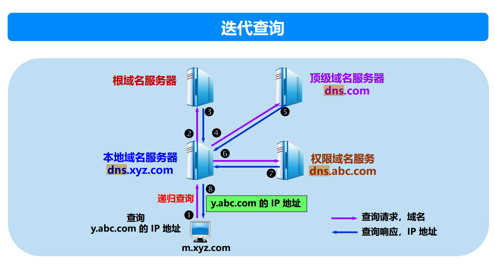
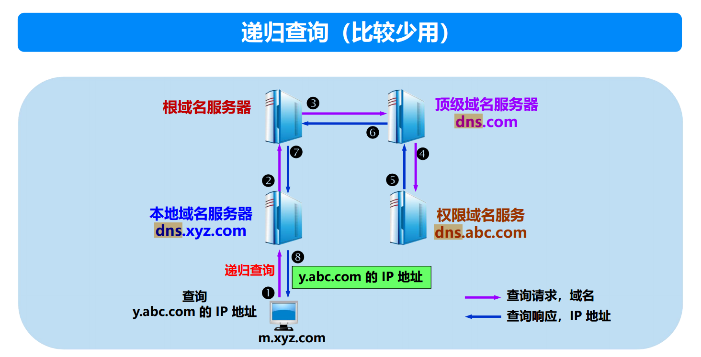

**DNS（Domain Name System，域名系统）** 是互联网中的一个核心服务，负责将域名（如`www.baidu.com`）解析为IP地址（如`123.125.114.144`），以便客户端（如浏览器）能够与服务器建立通信。以下是以查询`www.baidu.com`为例，DNS查询的详细过程以及其优化方式（快速DNS解析）的解释。

---

### **DNS查询过程**

#### **场景假设**
1. 主机需要访问`www.baidu.com`，但不知道其对应的IP地址。
2. 主机使用DNS解析服务来获取该域名对应的IP地址。

---

#### **1. 主机向本地DNS服务器发送请求**
- **步骤**：
  - 用户在浏览器中输入`www.baidu.com`。
  - 主机（客户端）首先向**本地DNS服务器**发送DNS查询请求。本地DNS服务器通常由用户的互联网服务提供商（ISP）提供。
- **本地DNS服务器的作用**：
  - 本地DNS服务器负责缓存查询结果，并充当中间代理与其他DNS服务器通信。
  - 本地DNS服务器会优先查看其缓存中是否存在`www.baidu.com`对应的IP地址。

---

#### **2. 本地DNS服务器检查缓存**
- **缓存存在**：
  - 如果本地DNS服务器缓存中已经存储了`www.baidu.com`的IP地址（并且缓存未过期），则直接将结果返回给主机，完成DNS查询。
- **缓存不存在**：
  - 如果本地DNS服务器没有缓存该域名的解析结果，则需要进行进一步查询，依次向上层的DNS服务器发送请求。

---

#### **3. 查询权威域名服务器的地址**
如果本地DNS服务器没有缓存`www.baidu.com`的解析结果，查询过程进入逐级递归或迭代查询阶段：

##### **(1) 查询根域名服务器**
- 本地DNS服务器首先向**根域名服务器**发送请求，询问`www.baidu.com`的解析路径。
- **根域名服务器的作用**：
  - 根域名服务器不存储具体的域名解析记录，而是指引到对应顶级域名服务器（如`.com`、`.org`等）。
  - 根域名服务器返回负责`.com`域的**顶级域名服务器（TLD DNS）**地址。

---

##### **(2) 查询顶级域名服务器（TLD DNS）**
- 本地DNS服务器向`.com`顶级域名服务器发送请求，询问`www.baidu.com`的权威域名服务器地址。
- **TLD DNS的作用**：
  - 顶级域名服务器不存储子域名（如`www.baidu.com`）的具体解析记录，但会指引到负责`baidu.com`的权威域名服务器。
  - `.com`顶级域名服务器返回负责`baidu.com`的**权威域名服务器**地址。

---

##### **(3) 查询权威域名服务器**
- 本地DNS服务器向权威域名服务器发送请求，直接询问`www.baidu.com`对应的IP地址。
- **权威域名服务器的作用**：
  - 权威域名服务器存储子域名（如`www.baidu.com`）的具体解析记录。
  - 权威域名服务器返回`www.baidu.com`的IP地址（例如`123.125.114.144`）。

---

#### **4. 本地DNS服务器缓存结果并返回IP地址**
- 本地DNS服务器将从权威域名服务器获得的`www.baidu.com`的IP地址缓存下来，以便后续查询更快。
- 然后将该IP地址返回给主机。

---

#### **5. 主机与目标服务器建立通信**
- 主机根据返回的IP地址，使用TCP或UDP协议与目标服务器建立连接（例如，通过HTTP协议下载网页内容）。

---

### **DNS查询的两种模式**

#### **1. 递归查询**
- **定义**：
  - 由本地DNS服务器负责所有查询工作，逐级向根域名服务器、顶级域名服务器、权威域名服务器发送请求。
  - 本地DNS服务器在获取结果后返回给客户端。
- **特点**：
  - 对客户端透明，简化了客户端的实现。
  - 查询负担由本地DNS服务器承担。

#### **2. 迭代查询**
- **定义**：
  - 如果本地DNS服务器无法直接回答查询请求，它会将查询结果指引到下一层DNS服务器（如根域名服务器）。
  - 客户端负责逐级向上层DNS服务器发送查询请求，直到获取最终的结果。
- **特点**：
  - 客户端实现复杂，查询负担分散。

---

### **优化DNS解析（快速DNS解析）**

为了提升DNS解析的速度，以下机制被广泛采用：

#### **1. 本地DNS缓存**
- 本地DNS服务器会缓存先前的解析结果（包括IP地址和权威域名服务器地址）。
- **优势**：
  - 避免重复查询，减少时延。
  - 减轻上层DNS服务器的负担。

#### **2. 浏览器/操作系统缓存**
- 用户的浏览器或操作系统也会缓存先前的DNS查询结果。
- **优势**：
  - 提供即时解析，避免与本地DNS服务器交互。
- **缺点**：
  - 如果缓存过期或不一致，可能导致解析失败。

#### **3. CDN技术**
- 网站通常使用CDN（内容分发网络）优化内容分发，同时改进DNS解析效率。
- **原理**：
  - CDN会在多个地理位置部署服务器，并通过DNS将用户请求指引到距离最近的服务器。
  - 缩短了网络传输距离，提升了响应速度。

#### **4. 负载均衡和异地分布**
- 大型网站（如百度）通常部署多个权威域名服务器，通过负载均衡将用户查询分配到不同服务器，避免单点瓶颈。

#### **5. DNS预解析**
- 浏览器在加载网页时，会提前解析页面中可能用到的域名。
- **效果**：
  - 提高网页加载速度，减少用户等待时间。

---

### **总结：`www.baidu.com`的DNS解析过程**

1. **客户端查询本地DNS服务器**：
   - 检查本地缓存，若无结果则进入递归查询。

2. **本地DNS服务器逐级查询**：
   - 首先向根域名服务器请求`com`顶级域名服务器地址。
   - 然后向`com`顶级域名服务器请求`baidu.com`的权威域名服务器地址。
   - 最后向权威域名服务器查询`www.baidu.com`的IP地址。

3. **本地DNS服务器返回结果**：
   - 将解析结果缓存，并返回给客户端。

4. **客户端使用IP地址访问目标服务器**：
   - 根据返回的IP地址建立连接，完成数据传输。

DNS解析通过逐层查询（或缓存优化）找到域名对应的IP地址，确保互联网的高效运行。


### **手动查询DNS记录的方法**

在日常网络故障排查、域名解析验证或学习DNS原理时，可以通过手动查询DNS记录来查看域名的解析过程。以下是几种常用的手动查询方法以及步骤。

---

### **1. 使用 `nslookup` 命令**

`nslookup` 是一种广泛使用的 DNS 查询工具，可以用来查询域名的 IP 地址、特定的 DNS 记录（如 A、MX、CNAME 等），并查看解析过程。

#### **基本用法**
- **查询域名对应的 IP 地址**：
  ```bash
  nslookup www.baidu.com
  ```
  **输出示例**：
  ```
  Server:  8.8.8.8
  Address: 8.8.8.8#53

  Non-authoritative answer:
  Name:    www.baidu.com
  Address: 123.125.114.144
  ```

  **解释**：
  - **Server**：当前使用的 DNS 服务器（如 Google 的 8.8.8.8）。
  - **Non-authoritative answer**：非权威回答，表示返回的结果来自缓存，而非直接从权威 DNS 服务器查询得出。
  - **Name/Address**：域名和其对应的 IP 地址。

#### **查询特定 DNS 记录**
- 查询 MX 记录（邮件服务器）：
  ```bash
  nslookup -query=mx baidu.com
  ```
  **输出示例**：
  ```
  baidu.com mail exchanger = mx.baidu.com
  ```

- 查询权威 DNS 服务器：
  ```bash
  nslookup -type=ns baidu.com
  ```
  **输出示例**：
  ```
  baidu.com nameserver = dns.baidu.com
  ```

#### **指定特定的 DNS 服务器**
- 如果想指定某个 DNS 服务器（例如 Google DNS：8.8.8.8）来查询，可以用以下命令：
  ```bash
  nslookup www.baidu.com 8.8.8.8
  ```


----