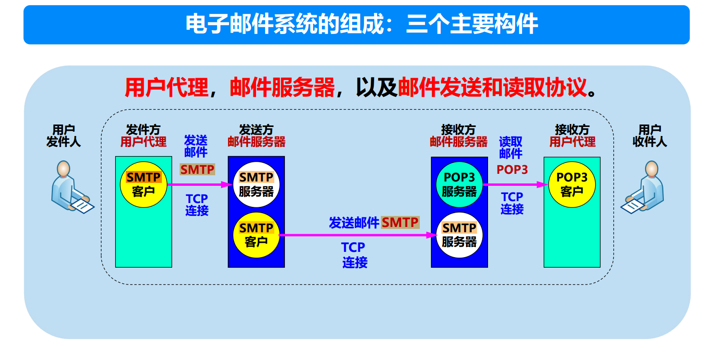

SMTP（**Simple Mail Transfer Protocol**，简单邮件传输协议）是电子邮件发送的标准协议，用于在发送方和接收方的邮件服务器之间传递邮件报文。以下是SMTP发送邮件过程的详细解释，包括各个步骤的功能和运行原理。

---

### **SMTP发送邮件的过程**

#### **1. 用户撰写邮件**
- **发送方调用邮件代理**：
  - 用户使用邮件客户端（如Outlook、Thunderbird）或Web邮箱（如Gmail、Yahoo Mail）撰写邮件。
  - 用户提供必要的信息：
    - 接收方邮箱地址（如 recipient@example.com）。
    - 报文内容（邮件主题、正文、附件等）。
  - 一旦邮件撰写完成，用户通过邮件客户端发送该报文。

#### **2. 邮件代理将报文发送到发送方邮件服务器**
- **邮件队列**：
  - 用户代理将邮件发送到发送方的邮件服务器（通常由互联网服务提供商或企业托管）。
  - 邮件服务器会将邮件临时存放在**邮件队列**中，等待进一步处理。
  - 邮件代理可能使用**SMTP协议**将邮件提交给邮件服务器。

---

#### **3. 建立SMTP连接**
- **SMTP客户端发现邮件队列中的报文**：
  - 发送方邮件服务器运行着一个**SMTP客户端模块**，它定期扫描邮件队列。
  - 发现有待发送的邮件时，SMTP客户端开始工作。
- **与接收方邮件服务器建立TCP连接**：
  - SMTP客户端解析接收方邮件地址的域名（如 `example.com`）。
  - 通过**DNS查询**获取接收方邮件服务器的IP地址。
    - 具体来说，查询域名的 **MX记录**（Mail Exchange Record）以定位接收方邮件服务器。
  - 使用TCP协议，在发送方邮件服务器和接收方邮件服务器之间建立一个TCP连接（通常使用端口25）。

---

#### **4. SMTP会话及报文传输**
- **SMTP握手**：
  - 一旦TCP连接建立，双方进入SMTP会话。握手过程包括：
    - **发送方邮件服务器（SMTP客户端）**向接收方服务器发出 `HELO` 或 `EHLO` 命令，表明自己身份。
    - **接收方邮件服务器（SMTP服务器）**回应 `250 OK`，表示可以继续。
- **报文传输**：
  - SMTP客户端按照SMTP协议发送邮件信息，包含：
    1. **MAIL FROM**：指定邮件的发送方地址。
    2. **RCPT TO**：指定接收方地址。
    3. **DATA**：标记邮件内容的开始，随后是邮件报文（包括主题、正文和附件等）。
    4. **QUIT**：表示传输完成，关闭连接。
  - 接收方邮件服务器逐步验证发送方和接收方地址的有效性，并接收邮件报文。
- **数据传输完成**：
  - 如果传输成功，接收方邮件服务器返回确认消息（如 `250 Message accepted for delivery`）。
  - 如果失败，则返回错误代码（如 `550` 表示接收方邮箱不存在）。

---

#### **5. 邮件存储到接收方邮箱**
- **接收方邮件服务器的处理**：
  - 接收方邮件服务器将收到的邮件存储到接收方用户的邮箱中。
  - 邮件服务器可能会执行其他操作：
    - 扫描邮件是否含有病毒或垃圾内容。
    - 应用过滤规则（如分类或标记垃圾邮件）。
- **邮件存储位置**：
  - 邮件通常存放在接收方邮件服务器的邮件存储系统中，等待用户访问。

---

#### **6. 接收方读取邮件**
- **接收方用户代理**：
  - 接收方用户通过邮件客户端（如Outlook、Gmail）或Web界面访问邮件。
  - 接收方用户代理可能使用**POP3（Post Office Protocol）**或**IMAP（Internet Message Access Protocol）**协议从接收方邮件服务器下载邮件。
  - 用户可以在方便的时候阅读、回复或管理邮件。

---

### **SMTP流程总结**

以下是SMTP邮件发送的整个过程的概览：

1. **用户撰写并发送邮件**：
   - 通过邮件客户端提交邮件。
   - 用户代理负责将邮件传递到发送方邮件服务器。

2. **发送方邮件服务器处理**：
   - 发送方邮件服务器的SMTP客户端发现邮件队列中的报文。
   - 与接收方邮件服务器建立TCP连接。

3. **SMTP会话及数据传输**：
   - SMTP握手完成后，发送方邮件服务器将邮件报文发送给接收方邮件服务器。
   - 数据传输包括发送方地址、接收方地址和邮件内容。

4. **接收方邮件服务器存储**：
   - 接收方邮件服务器接收邮件，存储到接收方用户的邮箱中。

5. **接收方读取邮件**：
   - 接收方用户通过用户代理（如客户端或Web邮箱）访问邮箱并读取邮件。

---

### **SMTP的特点**

1. **基于TCP**：
   - SMTP使用TCP协议，确保邮件传输的可靠性。
   - 默认端口号为25（也可以使用加密端口，如587或465）。

2. **面向队列的传输**：
   - 邮件在发送前后会被放入队列，SMTP负责传递邮件并确保成功。

3. **仅支持纯文本**：
   - SMTP原生支持ASCII文本。对于二进制附件（如图片或文档），需要通过**MIME（多用途互联网邮件扩展）**编码为文本。

4. **逐跳传输**：
   - 如果接收方邮件服务器不可达，邮件可能经过多个中间SMTP服务器传递到目标。

5. **双向通信**：
   - SMTP支持客户端和服务器之间的请求与响应机制，确保传输可靠。

---

### **SMTP相关的协议**

1. **POP3（Post Office Protocol v3）**：
   - 用于接收邮件。
   - 将邮件从邮件服务器下载到本地，通常是一次性下载，服务器上不会保留副本。

2. **IMAP（Internet Message Access Protocol）**：
   - 用于接收邮件。
   - 支持在线管理和多设备同步，服务器保留邮件副本。

3. **MIME（Multipurpose Internet Mail Extensions）**：
   - 扩展SMTP，允许传输非ASCII格式的数据（如图片、视频、附件）。

---

### **SMTP过程的示例（命令交互）**

假设发送方发送邮件到接收方的 `recipient@example.com`：

1. **建立连接**：
   ```
   C: HELO mail.sender.com
   S: 250 Hello mail.sender.com, pleased to meet you
   ```

2. **发送邮件**：
   ```
   C: MAIL FROM:<sender@sender.com>
   S: 250 OK
   C: RCPT TO:<recipient@example.com>
   S: 250 OK
   ```

3. **传输邮件内容**：
   ```
   C: DATA
   S: 354 Start mail input; end with <CRLF>.<CRLF>
   C: Subject: Test Email
      Hello, this is a test message.
      .
   S: 250 Message accepted for delivery
   ```

4. **关闭连接**：
   ```
   C: QUIT
   S: 221 Goodbye
   ```

通过以上交互，邮件从发送方成功传输到接收方邮箱。

---

### **总结**
SMTP是用于邮件发送的核心协议，通过以下步骤完成邮件传输：
1. 用户通过用户代理发送邮件。
2. 发送方邮件服务器利用SMTP协议发送邮件。
3. 接收方邮件服务器接收并存储邮件。
4. 接收方通过POP3或IMAP协议访问邮件。
SMTP以其可靠性和普遍性成为电子邮件系统的核心协议。


设置**邮件服务器**而不是点对点发送邮件，是因为点对点直接发送存在许多技术、实际使用场景和效率上的限制。邮件服务器作为中间层，解决了点对点传输邮件所带来的问题，确保邮件服务的可靠性、灵活性和高效性。以下是详细的解释：

---

### **为什么不能点对点发送邮件？**

#### **1. 接收方的可用性问题**
- **接收方需要始终在线**：
  - 如果采用点对点传输方式，发送方必须在接收方**在线且邮件客户端运行**时发送邮件。
  - 但在实际情况下，接收方可能并不一直在线或者邮件客户端并未运行，这会导致邮件无法及时送达。
  - 邮件服务器可以解决这个问题，即使接收方暂时不在线，服务器仍然可以暂存邮件，等待接收方上线后递交邮件。

#### **2. 对发送方的负担**
- **重试发送的开销**：
  - 如果接收方暂时无法接收邮件（例如设备关机或网络中断），发送方就需要反复尝试重新发送，直到接收成功。这会大大增加发送方的时间成本和资源开销。
  - 而邮件服务器会接管这部分功能，将发送方与接收方的时间同步解耦。

---

### **邮件服务器的作用**

#### **1. 解耦发送方和接收方的连接状态**
- 邮件服务器可以作为邮件传输的中间节点：
  - **发送方**只需将邮件发送到自己的邮件服务器，无需关注接收方的在线状态。
  - **接收方**的邮件服务器负责接收邮件，即使接收方离线，也可以将邮件暂存，确保数据不会丢失。
  - 接收方上线时，再从邮件服务器中提取邮件。

#### **2. 确保邮件传输的可靠性**
- **邮件暂存功能**：
  - 邮件服务器在接收方服务器暂时无法访问时，可以缓存邮件。
  - 如果接收方的邮件服务器宕机或超载，发送方的邮件服务器会定期尝试重新发送，直到成功为止。

#### **3. 提高邮件传输的效率**
- **批量管理**：
  - 邮件服务器可以将多个邮件统一处理，例如批量转发或合并多个目标的连接请求，减少点对点通信的开销。
- **负载均衡**：
  - 通过集群邮件服务器，可以均衡负载，防止因并发邮件量过大而导致性能下降。

#### **4. 跨网络传输的技术支持**
- **DNS MX记录支持**：
  - 电子邮件的发送通常依赖域名系统（DNS）的**MX记录**来定位接收方的邮件服务器。如果没有邮件服务器，就无法实现这样的全局邮件传递。
  - 发送方的邮件服务器通过DNS查询，能够找到接收方的邮件服务器并建立连接。

#### **5. 提供安全性和管理功能**
- **反垃圾邮件功能**：
  - 邮件服务器通过反垃圾邮件策略（如检查黑名单、启用SPF/DKIM认证等）过滤邮件，保护用户免受垃圾邮件的侵扰。
- **病毒扫描**：
  - 邮件服务器可以扫描附件中的病毒或恶意内容。
- **日志管理**：
  - 邮件服务器可以记录每封邮件的发送和接收状态，便于审计和排查问题。

---

### **点对点发送邮件的劣势**

#### **1. 对用户硬件要求高**
- 接收方的设备需要**24/7不间断运行**，以保证随时能够接收邮件。这对于普通用户来说不现实，尤其是电力、网络和设备的连续运行成本高。
- 用户需要配置固定的公网IP地址，以便发送方能直接定位接收设备，而这对普通用户并不容易实现。

#### **2. 网络协议与性能问题**
- **传输协议复杂**：
  - 点对点传输需要用户终端直接支持SMTP协议，这要求用户自行部署复杂的网络协议栈和配置。
- **传输效率低**：
  - 如果有大量用户同时尝试发送邮件，会导致网络连接数激增，每一对点对点连接都需要占用资源，降低效率。

#### **3. 无法跨网络或防火墙**
- 用户终端可能受限于NAT、ISP防火墙或者动态IP地址，导致点对点连接难以建立。
- 邮件服务器通常部署在固定的公网IP地址下，能够轻松跨越这些障碍。

#### **4. 安全性不足**
- 点对点传输难以实施加密传输，容易遭受数据泄露、攻击或中间人劫持。
- 邮件服务器通常提供TLS加密和身份验证功能，确保传输安全。

---

### **总结：邮件服务器的优势**

| **功能需求**         | **点对点传输的限制**                           | **邮件服务器的解决方案**                       |
|-----------------------|-----------------------------------------------|-----------------------------------------------|
| **接收方在线状态**    | 需要接收方始终在线，无法存储离线邮件           | 接收方邮件服务器可暂存邮件，待接收方上线处理 |
| **发送方的发送开销**  | 发送方需要反复重试发送，耗费时间和资源         | 邮件服务器负责重试发送，降低发送方的负担     |
| **邮件传输效率**      | 每次点对点连接都需要独立建立和管理，效率低     | 邮件服务器批量处理连接，优化资源利用率       |
| **跨网络问题**        | NAT、防火墙和动态IP阻碍点对点通信              | 邮件服务器有固定公网IP地址，轻松跨越网络障碍 |
| **安全性**            | 难以保证传输加密，数据易泄露                  | 提供加密传输（如TLS），保障数据安全           |
| **管理功能**          | 缺乏病毒扫描、垃圾邮件过滤等功能               | 支持多种安全和管理功能，提供完整的邮件服务   |

---

### **现实中邮件服务器的角色**
1. **发送方邮件服务器**：
   - 发送方的邮件客户端首先将邮件提交到其邮件服务器。
   - 邮件服务器负责后续的传输，包括DNS查询和连接接收方服务器。

2. **接收方邮件服务器**：
   - 接收方邮件服务器接收邮件后暂存，等待接收方用户读取邮件。
   - 提供IMAP或POP3协议供用户下载或管理邮件。

3. **中继邮件服务器**：
   - 有时邮件会经过多个中间服务器（称为中继服务器）传递，确保邮件能够跨越不同网络到达目标。

---

### **结论**
邮件服务器的存在大幅提高了邮件传输的可靠性、灵活性和效率。相比点对点传输，邮件服务器解决了接收方离线状态、发送方重试开销、跨网络障碍等问题，同时提供了更好的安全性和管理功能。对于现代电子邮件系统而言，邮件服务器是不可或缺的核心组件。