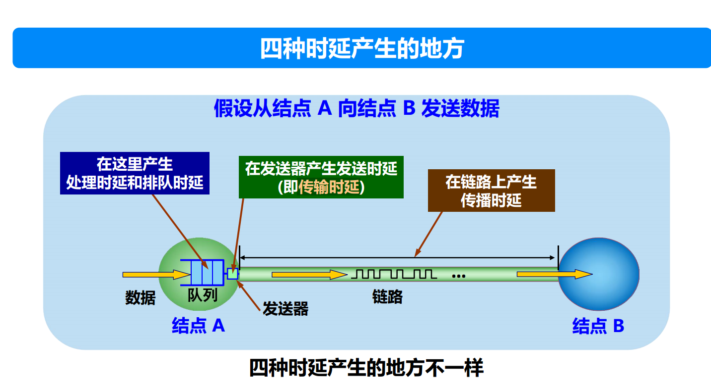

这张图片展示了网络通信中数据从节点 A 发送到节点 B 时产生的**四种时延**，分别是处理时延、排队时延、传输时延和传播时延。下面对这些时延的概念和其产生的地点进行详细解释。

---

### 1. **处理时延（Processing Delay）**
- **位置**：在节点 A 处理数据时产生（图片中标注为“处理时延”）。
- **定义**：处理时延是指网络设备（如路由器或主机）接收到数据后，用于检查比特级的错误、提取目标地址、处理报文头信息等操作所花费的时间。
- **特点**：
  - 处理时延通常较小（例如微秒级）。
  - 受设备的计算能力、数据包大小和复杂性影响。
- **优化**：提升设备的处理能力（例如使用更快的处理器）可以减少处理时延。

---

### 2. **排队时延（Queuing Delay）**
- **位置**：在节点 A 的队列中产生（图片中标注为“排队时延”）。
- **定义**：排队时延是指数据包在节点的发送队列中等待发送的时间。这种时延主要取决于当前网络设备的负载情况。
- **特点**：
  - 如果网络流量较低，排队时延可能接近于零。
  - 当网络繁忙（流量拥塞）时，排队时延可能非常高。
  - 不确定性较大，因为它与其他设备的行为和网络的瞬时负载相关。
- **优化**：通过流量工程、流量整形或增大设备队列容量可以缓解排队时延问题。

---

### 3. **传输时延（Transmission Delay）**
- **位置**：在节点 A 的发送器处产生（图片中标注为“传输时延”）。
- **定义**：传输时延是指将数据包从设备的发送器传输到链路上所需的时间。
- **计算公式**：
  $$
  \text{传输时延} = \frac{\text{数据包大小（比特）}}{\text{链路带宽（比特/秒）}}
  $$
- **特点**：
  - 受数据包大小和链路带宽的影响。
  - 链路带宽越高，传输时延越小；数据包越大，传输时延越高。
  - 对于较大的数据包或低速链路，传输时延可能占主导地位。
- **优化**：提升链路带宽或减少数据包大小可以降低传输时延。

---

### 4. **传播时延（Propagation Delay）**
- **位置**：在链路上传输时产生（图片中标注为“传播时延”）。
- **定义**：传播时延是指数据从节点 A 传输到节点 B 的链路上传播所需的时间。
- **计算公式**：
  $$
  \text{传播时延} = \frac{\text{链路长度（米）}}{\text{信号传播速度（米/秒）}}
  $$
- **特点**：
  - 主要取决于链路的物理长度和信号在介质中的传播速度。
  - 信号在光纤中的速度接近光速，在铜线中的传播速度略低。
  - 传播时延与数据包大小无关，取决于链路距离。
- **优化**：缩短链路长度或改用传播速度更快的介质（如光纤）可以减少传播时延。

---

### 计算时延的总和
网络总时延是这四种时延的加总：
$$
\text{总时延} = \text{处理时延} + \text{排队时延} + \text{传输时延} + \text{传播时延}
$$

---

### 四种时延的总结对比

| 时延类型     | 定义                                       | 影响因素                                | 特点                                  | 优化方法                       |
|--------------|--------------------------------------------|-----------------------------------------|---------------------------------------|--------------------------------|
| **处理时延** | 数据包在节点的处理时间                     | 设备性能、报文复杂性                    | 时间较短，确定性高                    | 提升设备性能                   |
| **排队时延** | 数据包在队列中等待的时间                   | 网络负载、队列长度                      | 不确定性高，随流量负载变化            | 流量整形、拥塞控制             |
| **传输时延** | 数据包从发送器发送到链路的时间             | 数据包大小、链路带宽                    | 数据包越大时延越高                    | 提升带宽，减少数据包大小       |
| **传播时延** | 数据在链路中传播的时间                     | 链路距离、信号传播速度                  | 与数据包大小无关，与链路距离相关      | 缩短距离，使用高效传播介质     |

---

### 实际场景中的影响
- **短距离网络**：在局域网（LAN）中，处理时延和排队时延占主导地位，因为传播时延和传输时延较短。
- **长距离网络**：在广域网（WAN）中，传播时延可能成为主要瓶颈，例如跨洋光缆通信。
- **拥塞场景**：在高负载的网络中，排队时延显著增加，是影响性能的主要因素。

---

### 结论
这四种时延涵盖了从数据生成到接收整个过程中产生的延迟。理解它们的特性和影响因素有助于优化网络性能，提高数据传输的效率。