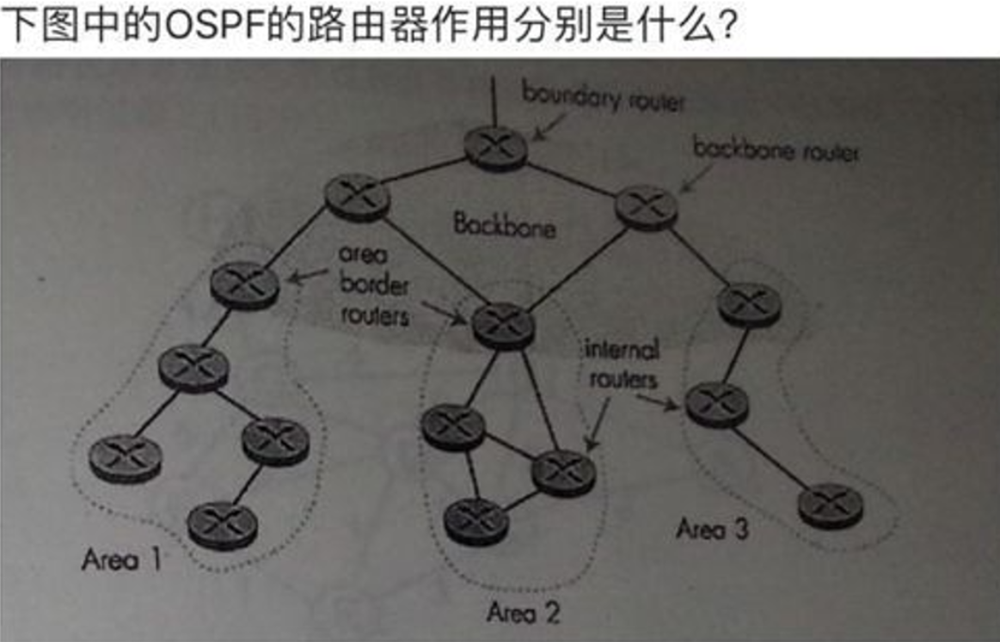

因特网采用 **层次选路**（Hierarchical Routing）的主要原因是为了提高网络的可扩展性、效率和管理性。因特网的规模极其庞大，涉及到数以亿计的主机和路由器。直接的全局路由（即每个设备都知道所有其他设备的路径）会导致路由表过于庞大，管理困难，而且会消耗大量计算和存储资源。因此，采用层次化的路由方法，按地域、自治系统（AS）等划分路由区域，可以有效地减少路由表的大小，提高路由选择的效率，降低网络拥塞。

### 1. **因特网采用层次选路的原因**
因特网采用层次选路的原因主要可以从以下几个方面进行解释：

#### a. **可扩展性**
- 随着因特网的不断扩展，网络的规模已经远远超过了任何单一的路由器能够处理的范围。如果所有的路由器都存储全局路由表，路由表的大小将急剧增加，导致存储、计算和传输开销极大。
- 层次化选路允许将网络划分为多个自治系统（AS），每个AS内的路由器只需维护本地的路由信息，不必关心整个因特网的所有路由。

#### b. **减少路由表的大小**
- 层次选路通过将网络分成多个区域（如自治系统、区域或分段），将全网的路由表分成较小的子表，使得每个路由器只需要存储与其直接相关的路由信息，而不是整个因特网的路由信息。
- 这样可以显著减少路由表的大小，减轻路由器的计算负担和存储压力。

#### c. **提高路由的效率**
- 在一个较小的区域内，路由选择仅依赖于该区域内部的信息。层次选路可以减少跨区域的路由更新和查询，减少网络中路由协议的开销。
- 在路由决策时，局部网络的拓扑变化不会影响到整个因特网的路由性能，提高了路由选择的效率。

#### d. **简化管理与故障隔离**
- 层次选路可以通过自治系统（AS）边界来划分管理责任。每个AS由不同的网络管理员负责，自治系统内的路由可以独立维护。
- 如果发生故障或网络拓扑变化，层次选路能够在局部范围内进行处理，避免影响到整个因特网。

#### e. **增强路由协议的容错性和可恢复性**
- 层次结构可以使得网络更加容错。每个AS或区域之间有明确的边界，局部故障不会影响整个网络的正常工作。

### 2. **自治系统（AS）的划分**
**自治系统（Autonomous System，AS）** 是因特网中一组由同一管理实体控制的 IP 网络和路由器的集合，它们共享一个统一的路由策略，并通过路由协议互相交换路由信息。AS 是因特网层次化结构中的一个重要组成部分。

- **AS的划分：** 
  - 每个自治系统都有一个唯一的 AS 编号（ASN）。AS 主要根据行政区域、运营商、网络运营商、企业或组织的不同来划分。每个 AS 都有自己的路由协议和路由表，并通过外部网关协议（EGP）与其他 AS 进行通信。
  - 比如，一个大型ISP（互联网服务提供商）可能有多个AS来管理它的网络，而每个企业、学校、研究机构等也可能有一个自己的AS。
  
- **AS的类型：**
  - **边界网关（Border Gateway）:** 位于 AS 边缘的路由器，通过外部网关协议（如 BGP）与其他 AS 交换路由信息。
  - **内部网关（Interior Gateway）:** 在同一个 AS 内部，负责在 AS 内部的路由器之间交换信息，常见的协议有 OSPF、RIP等。
  
- **AS 号的分配：** AS号是由互联网号码分配局（IANA）管理并分配的，AS号是全球唯一的。

### 3. **常见的路由协议**
因特网中使用了多种路由协议来支持层次选路。这些协议通常可以分为 **内部网关协议（IGP）** 和 **外部网关协议（EGP）** 两类。

#### a. **内部网关协议（IGP）**
内部网关协议是在同一个自治系统内部使用的协议。常见的IGP协议包括：

- **RIP（Routing Information Protocol）**
  - **特点：** RIP 是一种基于距离向量的路由协议，通过跳数来计算最短路径。RIP 的最大跳数限制为 15，超过 15 跳的网络被认为是不可达的。
  - **优点：** 配置简单，易于实现。
  - **缺点：** 不适用于大型网络，收敛速度慢，对网络拓扑变化的响应较慢。

- **OSPF（Open Shortest Path First）**
  - **特点：** OSPF 是一种基于链路状态的路由协议，它通过交换链路状态信息来构建网络拓扑图，使用 Dijkstra 算法计算最短路径。
  - **优点：** 更适用于大型网络，支持区域划分（区域化设计），提高了可扩展性和路由效率。
  - **缺点：** 配置相对复杂，对计算和内存有一定的要求。

#### b. **外部网关协议（EGP）**
外部网关协议用于不同自治系统之间的路由交换。最常见的 EGP 是 **BGP（Border Gateway Protocol）**。

- **BGP（Border Gateway Protocol）**
  - **特点：** BGP 是因特网中最重要的外部网关协议，使用路径向量算法来传递路由信息，能够支持跨自治系统的路由选择。BGP 支持复杂的策略控制，能够根据多种条件（如路径长度、AS路径、政策等）来选择最佳路由。
  - **优点：** 适用于大规模的自治系统间路由，能够处理复杂的路由策略和路径选择。
  - **缺点：** 配置和维护较为复杂，收敛速度较慢。

### 4. **总结**
因特网采用层次选路是为了提高网络的可扩展性、效率、管理性以及容错能力。通过划分自治系统（AS），每个自治系统管理自己的路由选择，减少了全网路由表的规模，减少了路由计算的开销。常用的路由协议包括：
- **内部网关协议（IGP）**：如 RIP、OSPF 和 IS-IS，主要用于自治系统内部的路由管理。
- **外部网关协议（EGP）**：如 BGP，主要用于不同自治系统之间的路由交换。

----

在这张图中，OSPF（开放最短路径优先）路由器的角色分别是：

1. **Backbone Router（主干路由器）**：
   - 位于OSPF网络的主干区域（Area 0）。
   - 负责在主干区域内传递路由信息，并与其他区域的边界路由器进行通信。

2. **Area Border Router（区域边界路由器）**：
   - 连接一个或多个OSPF区域与主干区域。
   - 负责在不同区域之间传递路由信息。
   - 维护每个连接区域的路由表，并在区域之间进行路由汇总。

3. **Internal Router（内部路由器）**：
   - 位于某个特定的OSPF区域内。
   - 只与同一区域内的其他路由器进行通信。
   - 维护该区域内的完整路由信息。

4. **Boundary Router（边界路由器）**：
   - 通常指连接OSPF网络与外部网络的路由器。
   - 负责将外部路由信息引入OSPF网络。

在OSPF中，这些路由器角色的划分有助于优化路由信息的传播，减少网络开销，并提高网络的可扩展性和稳定性。
