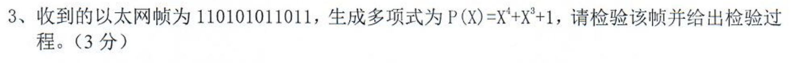

### CRC（循环冗余校验）

在这个例子中，我们需要验证接收到的数据是否正确。

给定信息：
- 接收到的数据序列：11010101011
- 生成多项式：P(X) = X^4 + X^3 + 1（对应二进制序列：11001）

解题步骤：

1. 首先将接收到的数据序列写出来：
   11010101011

2. 使用生成多项式 P(X) = X^4 + X^3 + 1，对应的二进制序列是 11001

3. 进行模2除法运算：
   ```
   11010101011 ÷ 11001
   11001
   -----
   00011
    11001
    -----
    00100
     11001
     -----
     01010
      11001
      -----
      00111
       11001
       -----
       01110
        11001
        -----
        01011
         11001
         -----
         00100
   ```

4. 由于除法结果的余数为00100，说明接收到的数据序列不能被生成多项式整除。

因此，我们可以得出结论：接收到的数据序列是错误的，在传输过程中发生了错误。CRC是一种非常有效的错误检测方法，广泛应用于数据通信中。
