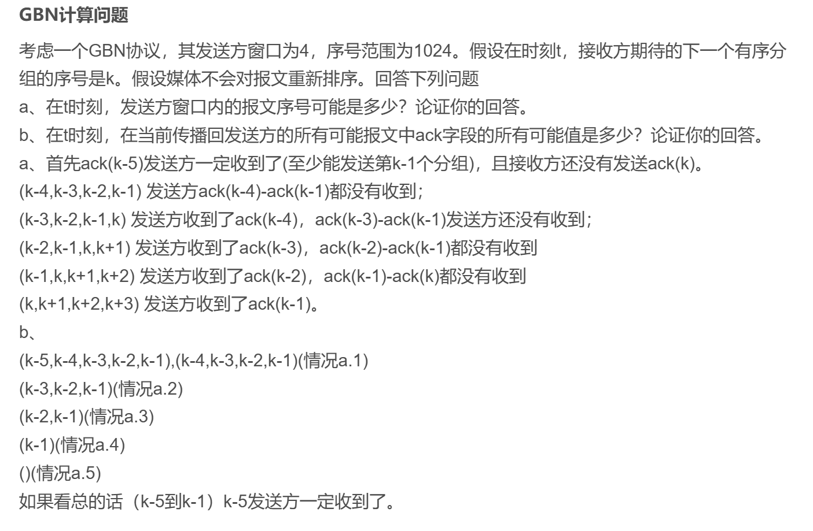

GBN（Go-Back-N）和SR（Selective Repeat）是两种常见的自动重传请求（ARQ）协议，它们都用于保证可靠的数据传输，但它们的工作原理和窗口管理机制有所不同。下面将详细解释这两种协议的工作过程、发送窗口的大小和相关细节。

### 1. **GBN（Go-Back-N）协议**

#### 工作过程：
- **序列号**：GBN协议中的每个数据包都有一个序列号，序列号的长度通常是`K`位，因此可以表示`2^K`个不同的序列号。
- **发送窗口**：发送方有一个大小为`N`的滑动窗口，窗口的大小是`N = 2^K`，允许最多`N`个数据包未确认。发送方可以连续发送最多`N`个数据包，但只能等待最早发送的`N`个包的确认。
- **确认机制**：接收方只确认已成功接收到的数据包，`ACK(n)`表示接收方已经成功接收了从0到`n`的所有数据包。也就是说，`ACK(n)`确认了所有序列号小于或等于`n`的数据包已经正确接收。
- **超时重传**：发送方在发送数据包时，为每个数据包设置一个定时器。如果该数据包的确认（`ACK`）没有在预定时间内收到，则会触发超时（`timeout(n)`）事件，重新发送该数据包及其之后所有未确认的数据包。这就是"Go-Back"的意思，发送方将重传从超时位置开始的所有数据包，而不仅仅是超时的数据包。
- **接收方行为**：接收方的窗口大小为1，接收方始终期望接收下一个序列号的数据包。如果接收到的包不是期望的序列号，则会丢弃该数据包，不会发送任何确认。也就是说，接收方只能接收序列号按顺序到达的数据包。

#### 发送窗口大小：
- 发送窗口大小为`N = 2^K`，表示发送方最多可以发送`2^K`个数据包而不等待确认。

#### 总结：
- **GBN的特点**是：发送方会一直发送数据包，直到窗口满。接收方不缓存数据包，只会接收期望序列号的包。发送方遇到超时事件时，会重发超时后的所有数据包。GBN效率较低，因为当出现丢包或错误时，发送方必须重传大量数据。

---

### 2. **SR（Selective Repeat）协议**

#### 工作过程：
- **序列号**：SR协议也为每个数据包分配序列号，序列号长度为`K`位，可以表示`2^K`个不同的序列号。
- **发送窗口**：与GBN不同，SR协议的发送窗口是**滑动窗口**，发送方只能在窗口范围内发送数据包。当一个数据包被确认时，发送窗口会向前滑动，可以发送新的数据包。窗口大小通常为`N`，但`N`必须满足`N <= 2^K`，防止序列号重叠。
- **确认机制**：接收方为每个数据包分别发送确认`ACK`，而不是像GBN一样确认一段连续的序列号。每当接收到一个正确的数据包时，接收方会发送一个对应的`ACK(i)`，表示接收到序列号为`i`的包。
- **接收方缓存**：接收方可以缓存接收到的无序数据包，如果接收到一个不符合期望序列号的数据包，接收方会将其缓存，等待缺失的数据包。当接收到期望的序列号的数据包时，接收方会交付给上层并检查缓存中是否有缺失的数据包。只有当接收方的窗口内的所有数据包都成功接收并交付时，接收方才会给发送方发送确认。
- **重传机制**：发送方只会重传那些未收到确认的数据包。当某个数据包的确认未在规定时间内收到时，发送方才会重发该数据包。与GBN不同，SR不会重发窗口内所有的包，而只重发丢失的那个包，节省了带宽和传输时间。

#### 发送窗口和接收窗口：
- **发送窗口大小**：发送方的窗口大小通常为`N`，表示发送方可以在接收到确认之前发送最多`N`个数据包。
- **接收窗口大小**：接收方的窗口大小也是`N`，并且接收方必须能够缓存并管理这些接收的数据包，以便在顺序到达时正确交付给上层。

#### 序列号的关系：
- 在SR协议中，**发送窗口大小和接收窗口大小必须满足`N + N <= 2^K`**，这样才能避免发送方和接收方的序列号出现冲突，导致重传数据包时出现错误。这个限制确保了接收方能够准确区分不同的序列号，避免因为接收方的ACK丢失或重传造成混淆。

#### 总结：
- **SR的特点**是：接收方有缓存机制，可以处理乱序到达的数据包。发送方只重传那些丢失的包，而不是重传整个窗口内的所有包。SR相较于GBN在丢包时更为高效，因为它避免了重传不必要的数据。

---

### GBN与SR的主要区别：
| 特性                  | GBN（Go-Back-N）                | SR（Selective Repeat）               |
|---------------------|--------------------------------|------------------------------------|
| **发送窗口大小**      | `N = 2^K`                      | `N`（一般较小，取决于`K`）       |
| **接收方窗口大小**    | 1                              | `N`（可以缓存多条数据）           |
| **确认方式**          | `ACK(n)`（连续确认）             | `ACK(i)`（每个数据包独立确认）    |
| **超时重传**          | 超时后重传所有未确认的数据包     | 超时后仅重传丢失的数据包         |
| **接收方处理方式**    | 丢弃非期望序列号的包             | 缓存非期望的包，等待缺失的数据包 |
| **效率**              | 低，容易重复发送不必要的数据包    | 高，避免了不必要的重传           |

### 总结：
- **GBN**适用于简单、低开销的场景，但因为它需要重传大量无用数据包，所以效率较低。
- **SR**通过缓存机制和选择性重传，避免了不必要的数据重传，因此在网络条件较差时能更高效地利用带宽。

在 **GBN（Go-Back-N）协议** 中，发送方和接收方通过滑动窗口实现可靠数据传输。以下是对问题的详细解答和论证。

---

### **问题 a：发送方窗口内的报文序号可能是多少？**

#### 背景
- **发送方窗口大小**：4
- **序号范围**：0～1023（总共有 1024 个序号，序号是循环使用的）。
- **接收方的状态**：接收方期待下一个有序分组的序号为 `k`。

#### 发送方窗口的可能范围
在 GBN 中：
1. 发送方窗口的最小边界是最后一个收到确认的 ACK 的序号加 1。
2. 最大边界是最小边界加上窗口大小减 1。
3. 发送方只能发送序号在其窗口范围内的分组。

对于接收方期待序号 `k`，以下条件限制了发送方窗口的范围：
1. **ACK 确认条件**：
   - 接收方期待的下一个分组序号为 `k`，说明接收方已经确认并接收了序号为 `k-1` 的分组。
   - 因此，发送方一定收到了 ACK(`k-1`)，可以将窗口滑动到 `k`。

2. **窗口大小限制**：
   - 发送方窗口的大小是 4，因此发送方窗口内可能的分组序号范围是：
     - `[k, k+1, k+2, k+3]`。

#### 论证
由于 GBN 的特性：
1. 在没有乱序的情况下，序号 `k` 之前的所有分组都已被接收方确认。
2. 发送方窗口只能包括尚未被确认的分组序号，因此它的范围是从 `k` 开始，到 `k+3` 为止。

**答案**：
在时刻 `t`，发送方窗口内的报文序号可能是：`k, k+1, k+2, k+3`。

---

### **问题 b：当前传播回发送方的所有可能 ACK 值是多少？**

#### 背景
- 接收方总是发送 ACK 来表示它所期待的下一个分组序号（即 `k`）。
- ACK 是累积确认：确认值 `ack = m` 表示序号小于 `m` 的所有分组都已被正确接收。

#### 可能的 ACK 值分析
在时刻 `t`，接收方可能已经接收并发送了一些 ACK，但由于传播延迟，这些 ACK 并未到达发送方。

1. **接收方状态**：
   - 接收方当前期待序号是 `k`，因此它会发送 ACK(`k`)。
   - 之前的 ACK（如 ACK(`k-1`), ACK(`k-2`) 等）也可能仍在传播中。

2. **ACK 的传播范围**：
   - GBN 协议假定报文按序传输，因此不会有比当前期待值 `k` 更高的 ACK 在路上。
   - 因此，发送方可能接收到的 ACK 值范围是：
     - `[k-5, k-4, k-3, k-2, k-1]`。

   **为什么是从 `k-5` 开始？**
   - 由于发送方窗口大小为 4，发送方在滑动窗口之前至少已经收到并确认了 `k-1`，说明 `ACK(k-1)` 的确认是基于接收到的 `ACK(k-5)` 或更早的值滑动窗口得到的。

#### 论证
- 发送方已收到 ACK(`k-5`)（因为发送方窗口已滑动到覆盖序号 `k`）。
- ACK(`k-4`), ACK(`k-3`), ACK(`k-2`), ACK(`k-1`) 都可能在传播中。
- ACK(`k`) 还未传回发送方，因为接收方刚开始期待序号 `k`。

**答案**：
传播回发送方的所有可能 ACK 字段值是：`k-5, k-4, k-3, k-2, k-1`。

---

### **总结**

#### 问题 a：
- **发送方窗口内的报文序号可能是**：`k, k+1, k+2, k+3`。

#### 问题 b：
- **传播回发送方的所有可能 ACK 字段值是**：`k-5, k-4, k-3, k-2, k-1`。

这些答案基于 GBN 协议的特点：滑动窗口机制、累积确认、无乱序的假设，以及发送方始终等待接收方的 ACK 来移动窗口的特性。

----
在 **Selective Repeat (SR)** 协议中，相较于 **Go-Back-N (GBN)** 协议，主要的区别是 **接收方能单独确认每个分组**，而不是像 GBN 那样只能确认到某一个连续的序号。因此，SR 协议的 ACK 机制和窗口管理会有所不同。下面是关于如何回答与 SR 协议相关的类似问题的详细分析。

---

### **问题 a：发送方窗口内的报文序号可能是多少？（SR 协议）**

#### 背景
- **发送方窗口大小**：4
- **序号范围**：0～1023（总共有 1024 个序号，序号是循环使用的）
- **接收方的状态**：接收方期待下一个有序分组的序号为 `k`。

#### 发送方窗口的可能范围（SR 协议）：

1. **SR 与 GBN 的不同**：在 **SR** 协议中，接收方可以对每个分组单独确认，因此发送方窗口内可能会有多个分组是未确认的，并且这些分组的序号可以不连续（与 GBN 中的连续性要求不同）。

2. **发送方窗口的大小限制**：
   - 发送方的窗口大小是 4，因此，发送方窗口内最多会有 4 个未确认的报文。
   - 发送方窗口的范围是从当前已确认的序号开始，最多扩展到已确认序号的 4 个后续序号。
   
3. **序号的范围**：
   - 假设接收方期望的下一个分组的序号为 `k`，这意味着发送方已经收到了确认号为 `k-1` 的 ACK，因此窗口至少会开始从 `k` 这个序号。
   - 但是，SR 协议允许在窗口内包含不连续的序号。因此，发送方窗口内的序号可能是连续的，也可能是非连续的，但仍必须满足序号在 `k` 和 `k+3` 之间，且总共有最多 4 个未确认的报文。

#### **答案：**
在 **SR** 协议下，发送方窗口内的报文序号可能是 **`k, k+1, k+2, k+3`**，但也有可能是其中的一部分，不一定是连续的。例如，窗口可能包含 `k, k+2, k+3` 等非连续序号，具体取决于哪些分组已经被接收方确认。

---

### **问题 b：当前传播回发送方的所有可能 ACK 值是多少？（SR 协议）**

#### 背景
- **接收方状态**：接收方期待的下一个分组序号为 `k`，并且接收方可能已经确认了一些分组。

#### 可能的 ACK 值分析（SR 协议）：

在 **SR 协议** 中，ACK 是针对每个具体分组单独确认的，因此传播回发送方的 ACK 可能不仅是累积确认（即确认某个分组之前的所有分组），而是**单独确认每个分组的接收情况**。

1. **接收方的 ACK 行为**：
   - 接收方会针对每个分组发送 ACK，因此，如果接收方已经接收到序号为 `k-1`, `k-2`, `k-3` 等的分组，它将会分别发送对应的 ACK 值。
   - 每个 ACK 都是独立的，并且表示接收方已经成功接收并确认了该分组。

2. **传播回发送方的可能 ACK**：
   - 假设接收方期待的下一个分组序号是 `k`，说明接收方确认了序号 `k-1` 的分组。
   - 由于 SR 协议中每个分组都会单独确认，因此接收方可能已经对多个分组发送了 ACK。
   - 传播回发送方的 ACK 包括但不限于以下内容：
     - **ACK(k-1)**: 这是接收方对最后一个接收的分组的确认。
     - **ACK(k-2)**, **ACK(k-3)**, 等：如果这些序号的分组已经被接收并确认，接收方会单独发送这些 ACK。

3. **由于 SR 是基于单个确认的，** 接收方可能已经发送多个独立的 ACK，确认了序号 `k-1`, `k-2`, `k-3` 等。

#### **答案：**
传播回发送方的所有可能 ACK 值是：**`k-1, k-2, k-3, ...`**。这些值都是接收方针对单个分组的确认，每个 ACK 都表示接收方已经成功接收并确认了相应的分组。

---

### **总结：**

#### 问题 a：发送方窗口内的报文序号可能是多少？
- 在 **SR 协议** 中，发送方窗口内的报文序号可以是多个不连续的序号，因为每个分组会独立确认。发送方窗口大小为 4，因此它可能包括从 `k` 开始的最多 4 个序号，但这些序号可以是**不连续的**。

#### 问题 b：当前传播回发送方的所有可能 ACK 值是多少？
- 在 **SR 协议** 中，传播回发送方的 ACK 值会是多个独立的确认值，如 **`k-1, k-2, k-3, ...`**。这些 ACK 是针对每个单独分组的确认，接收方会根据接收到的分组顺序单独发出 ACK。

通过这些分析，可以看出 SR 协议与 GBN 协议的区别，SR 支持更细粒度的确认，并且允许不连续的窗口。