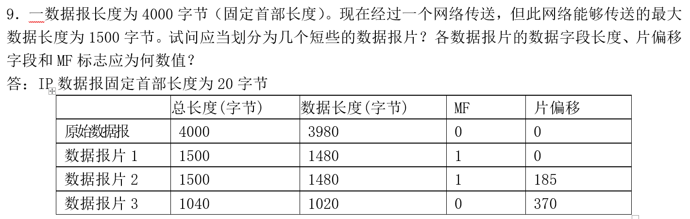

在计算机网络中，传输层和网络层是不同的协议层，每一层都负责不同的功能，处理不同类型的分组（或称为“包”）。虽然传输层已经对数据进行分组处理，但网络层仍然需要进一步对数据进行分组，主要是因为网络层处理的任务和传输层有所不同，涉及到的传输范围、地址解析以及路由选择等因素也不同。因此，网络层在传输层分组的基础上可能还需要进一步进行分组，具体原因如下：

### 1. **传输层的分组（传输层段）**
传输层（如 TCP 或 UDP）负责端到端的通信，它主要关注的是可靠的、面向连接的通信（例如 TCP）或者无连接的通信（例如 UDP）。传输层将应用层传输的数据分割成适合网络传输的小数据单元，每个单元称为“**传输层段**”或“**数据报文段**”。

- **TCP 和 UDP 的数据包**：在 TCP 协议中，每个数据包（段）通常包含应用数据以及控制信息（如端口号、序列号等），而在 UDP 协议中，它的包头较小，只有简单的源和目标端口信息，以及校验和等。
- **目的**：传输层主要是将大块的应用数据（如网页内容、文件等）分割成多个小数据段，以便适应下层网络的传输和保证端到端的可靠性（如TCP会进行重传、流量控制和顺序保证等）。

### 2. **网络层的分组（网络层包）**
网络层（如 IP）负责将数据从源设备传输到目标设备，通常需要跨越多个路由器或网络设备。网络层将接收到的传输层段（通常是 TCP 或 UDP 段）封装成 **IP 数据包**（或称为“分组”），并加上必要的网络层头部信息，如源和目的 IP 地址、路由信息等。

#### 为什么网络层需要重新分组？
传输层和网络层的分组（或包）结构不同，主要有以下几个原因：

### 2.1 **不同的封装与地址处理**
- **封装不同**：传输层将数据分割为传输层段，而网络层对这些传输层段进行封装，增加 IP 头部信息（例如源IP地址、目的IP地址、TTL等），以便在互联网上进行路由和传输。
- **地址空间不同**：传输层使用端口号来标识通信的应用程序（例如 TCP 端口或 UDP 端口），而网络层使用 IP 地址来标识主机或网络。因此，网络层需要对传输层段进行封装，加入源和目标 IP 地址，以便路由器能够正确地转发数据包。

### 2.2 **不同的分组大小**
- **传输层段的大小**：传输层段通常是为了确保数据可以在传输层之间顺利传输而划分的，它的大小可能并不适合网络层的传输。传输层段的大小受应用协议和网络连接的限制（如 TCP 最大段大小 MSS）等影响。
- **网络层的分组大小限制**：网络层的分组大小受物理层的传输媒介限制。例如，Ethernet 最大的帧大小是 1500 字节，如果传输层的段超过了该大小，网络层就需要进行 **分片**，即将过大的数据包拆分成多个较小的网络层分组，以便能够在物理网络中传输。

### 2.3 **数据包的路由与转发**
- **路由与转发**：网络层的一个重要功能是根据目标 IP 地址将数据包传送到目标设备。如果数据包太大，可能会由于不同网络设备或链路的 MTU（最大传输单元）限制而无法直接传输。为了应对这个问题，网络层会根据需要对数据包进行 **分片**，并通过不同的路由转发到目标主机。

### 3. **网络层的分片与重组**
网络层需要进行分组的一个关键原因是它需要考虑不同的物理媒介和链路的最大传输单元（MTU）限制。如果传输层的分段大小超过了某个链路的 MTU，网络层就会 **分片** 数据包，将一个大的数据包分割成多个小的片段进行传输。接收端在收到所有片段后会重新组合（**重组**）这些片段，恢复出原始的数据包。

#### 例子：
- **IP 分片**：假设网络链路的 MTU 为 1500 字节，而传输层的数据段为 2000 字节，网络层就会将其分成多个较小的 IP 包，每个包的大小为 1500 字节。每个分片会加上分片标识、偏移量等信息，以便接收端能够正确地将这些分片重组。
  
  - **IP 包头中的分片信息**：
    - **标识字段（Identification）**：所有分片使用相同的标识符。
    - **偏移量（Fragment Offset）**：指示每个分片在原始数据包中的位置。
    - **更多分片（More Fragments）标志**：标识是否还有更多分片。

### 4. **网络层的可靠性与不可靠性**
虽然传输层（特别是 TCP）提供了可靠的数据传输，但网络层（如 IP 协议）本身是 **不可靠** 的。它只负责尽可能将数据从源地址传输到目标地址，而不保证数据到达的可靠性或顺序。因此，网络层在分组过程中并不会进行错误恢复或重新排序，只是在需要时进行分片或传输。传输层在接收数据时需要负责对这些分片进行重组，并且在出现丢包时重新传输。

### 5. **总结：传输层和网络层的分组区别**
- **传输层**：负责对数据进行分段（segmenting），将应用数据切割成合适大小的段以便于传输。传输层的分段主要关注端到端通信（如端口号），并且会使用诸如 TCP、UDP 等协议进行控制和管理。
- **网络层**：在传输层分段的基础上进行封装，形成网络层的 **IP 数据包**。网络层的分组不仅要关注端到端的数据传输，还需要关注如何通过不同的路由器进行转发，并且考虑物理链路的传输限制（如 MTU）。如果传输层段过大，网络层需要进行 **分片** 来保证数据能够顺利传输。

网络层分组的关键功能包括：
- 处理网络地址（如 IP 地址）。
- 管理跨网络的数据传输。
- 根据需要对数据进行分片，确保适应不同网络的传输限制。
- 确保数据包在网络中的正确路由与转发。

因此，网络层仍然需要进行分组，以确保数据在不同的网络间高效、可靠地传输，并适应不同物理链路的限制。

----
**MTU（最大传输单元，Maximum Transmission Unit）** 和 **MSS（最大报文段大小，Maximum Segment Size）** 是计算机网络中与数据传输相关的两个重要概念，尤其是在传输层（如TCP/IP）和数据链路层的协议中。这两个概念都涉及到网络中数据包的大小，它们对网络性能、数据传输效率以及分段与组装过程有重要影响。虽然它们都与数据的“大小”相关，但它们的作用和定义有所不同。

### **1. MTU（最大传输单元）**

**MTU** 指的是在网络中，**数据链路层** 上可以传输的最大数据包（即帧）的大小。它是指网络接口（如以太网、Wi-Fi或其他物理链路）上能承载的最大字节数。

#### **MTU的作用和意义**
- **数据链路层的限制**：每种网络技术（如以太网、Wi-Fi、PPP等）都有自己的 MTU 限制，这个限制规定了数据链路层最大能够承载的数据包大小。超过 MTU 限制的 IP 数据包会被分段处理。
- **性能影响**：较大的 MTU 可能提高数据传输的效率，因为较大的数据包可以减少协议头的开销；但过大的 MTU 也可能增加传输时的延迟，尤其在网络设备或链路无法处理较大的数据包时。
- **分段与重组**：如果一个数据包超过了链路层的 MTU，它会被分段成多个较小的数据包。接收端需要重新组装这些数据包。网络中的每个路由器也可能根据其链路的 MTU 对数据包进行分段。

#### **MTU的大小**
- **以太网（Ethernet）**：常见的以太网 MTU 是 1500 字节。这是因为以太网帧的最大大小是 1518 字节（包括以太网帧头部），其中 18 字节用于以太网头部和尾部，剩余的 1500 字节用于数据部分。
- **P2P（点对点协议）**：P2P 的默认 MTU 是 1492 字节，这个值通常用于 DSL 网络中。
- **IPv6**：IPv6 的最小 MTU 要求是 1280 字节，允许较大的数据包传输，但为了兼容性，大多数 IPv6 网络仍然使用 1500 字节的 MTU。

#### **MTU Path Discovery（路径 MTU 发现）**
- **路径 MTU 发现** 是一种机制，用于动态地确定从源主机到目标主机的路径中最小的 MTU。路径中的每个路由器和链路可能有不同的 MTU 限制，源主机通过发送 ICMP “需要分段”消息来发现路径的最小 MTU。
  
  例如：
  - 如果一个数据包超过了链路的 MTU，路由器会发送一个 ICMP 错误消息，告知源主机该数据包需要被分段。

---

### **2. MSS（最大报文段大小）**

**MSS** 是 TCP 协议中的一个概念，表示 **传输层（TCP）** 允许的最大报文段大小。它定义了每个 TCP 段中可携带的最大数据量（即 **有效载荷**），不包括 TCP 头部。

#### **MSS的作用和意义**
- **避免数据包过大**：MSS 的设置是为了防止 TCP 数据段过大，以至于在传输过程中需要进行 IP 层的分段。TCP 数据段的大小应根据底层链路的 MTU 限制来调整。
- **TCP连接建立时的协商**：在 TCP 三次握手过程中，双方会交换 MSS 值。每个 TCP 端点会根据它自己链路的 MTU 设置一个 MSS 值，通常 MSS 会略小于链路的 MTU，以考虑到 TCP 头部的开销（通常是 40 字节，即 20 字节的 IP 头部和 20 字节的 TCP 头部）。
- **避免 IP 分段**：为了避免 IP 层的分段，TCP 会通过 MSS 来控制每个数据段的大小。通过调整 MSS，TCP 能够确保传输的数据段适应底层网络的 MTU 限制，避免过大数据段的分段处理。

#### **MSS的大小**
- **默认MSS**：通常情况下，MSS的默认值是 1460 字节。这个值是基于以太网的 MTU 1500 字节计算的，减去 IP 和 TCP 头部的大小（20 字节 + 20 字节 = 40 字节），所以有效载荷部分为 1460 字节。
- **调整MSS**：如果两端的 MTU 不同，或链路经过具有较小 MTU 的设备时，MSS 可能会调整。例如，如果链路的 MTU 是 1492 字节，MSS 通常会调整为 1452 字节。

#### **MSS和MTU的关系**
- MSS 直接受 MTU 限制，因为 TCP 数据段的大小不能超过底层网络的 MTU。通常，MSS 的大小是基于最大 MTU 减去 IP 和 TCP 头部的大小。
- 例如，如果底层链路的 MTU 为 1500 字节，且使用标准的 IPv4 和 TCP 头部，则：
  - MTU：1500 字节
  - 减去 IPv4 头部（20 字节）和 TCP 头部（20 字节），剩余有效载荷为 1460 字节。
  - 因此，MSS 通常设置为 1460 字节，以避免 IP 层的分段。

#### **MSS的协商**
在 TCP 连接的三次握手中，双方会交换 MSS 参数：
1. 客户端发送带有 MSS 值的 **SYN** 包。
2. 服务器响应时返回带有其 MSS 值的 **SYN-ACK** 包。
3. 客户端确认收到响应后，进行数据传输。

这样可以确保每一方在数据传输时都能使用适合的 MSS，避免分段。

---

### **MTU与MSS的区别与联系**

| 特性            | **MTU**                             | **MSS**                                   |
|-----------------|-------------------------------------|-------------------------------------------|
| **定义**        | 网络层（数据链路层）的最大数据包大小 | 传输层（TCP）中最大有效数据部分大小     |
| **涉及层**      | 数据链路层（如以太网、Wi-Fi等）     | 传输层（TCP协议）                        |
| **包含的内容**  | 包含数据、头部和尾部                | 仅包含数据部分，不包括 TCP 头部         |
| **默认大小**    | 1500 字节（以太网）                  | 1460 字节（基于以太网的 MTU）            |
| **主要作用**    | 决定网络中数据帧的最大大小          | 确保每个 TCP 数据段不会大于链路的 MTU    |
| **分段**        | 如果超过 MTU，数据包会被分段        | MSS 控制 TCP 数据段的大小，以避免 IP 分段 |
| **协商**        | 不涉及直接的协商                    | 在 TCP 连接建立时进行协商               |

### **总结**

- **MTU（最大传输单元）** 是指在网络中，数据链路层能够传输的最大数据包大小。它对网络性能有直接影响，如果数据包超过 MTU，将需要在 IP 层进行分段。
- **MSS（最大报文段大小）** 是指 TCP 连接中，单个 TCP 段最大可以承载的数据部分大小。MSS 的值通常是根据底层 MTU 设置的，它确保每个 TCP 段的有效载荷不会超过 MTU，避免 IP 层进行额外的分段。
- 两者之间的关系是：**MSS** 是 **MTU** 的一个子集，因为 TCP 数据段需要考虑到传输层和网络层的协议头部，因此 MSS 会比 MTU 小。

了解 MTU 和 MSS 对于优化网络性能、避免数据包分段、以及处理网络吞吐量和延迟非常重要。

