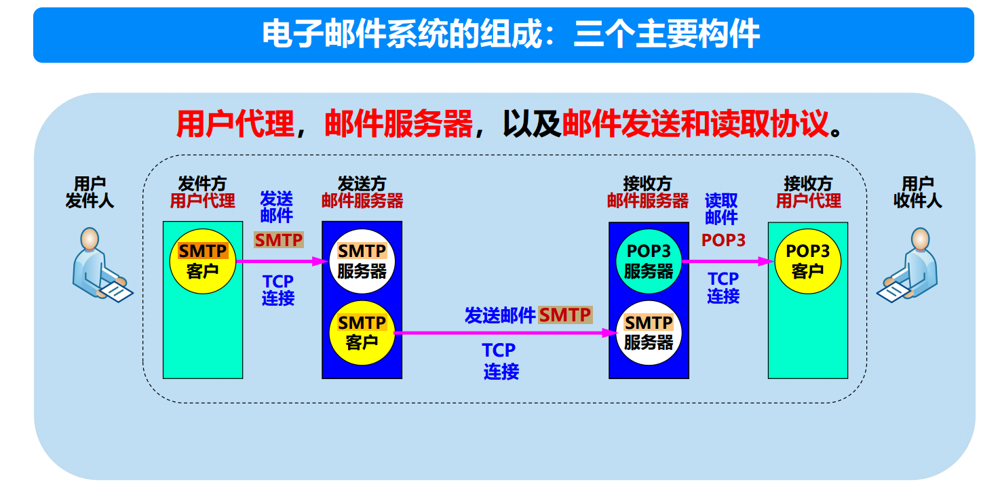
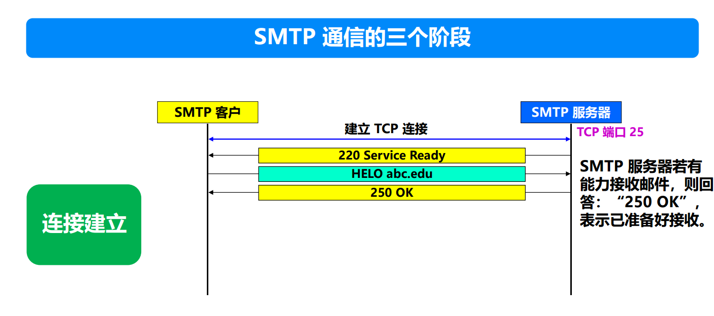
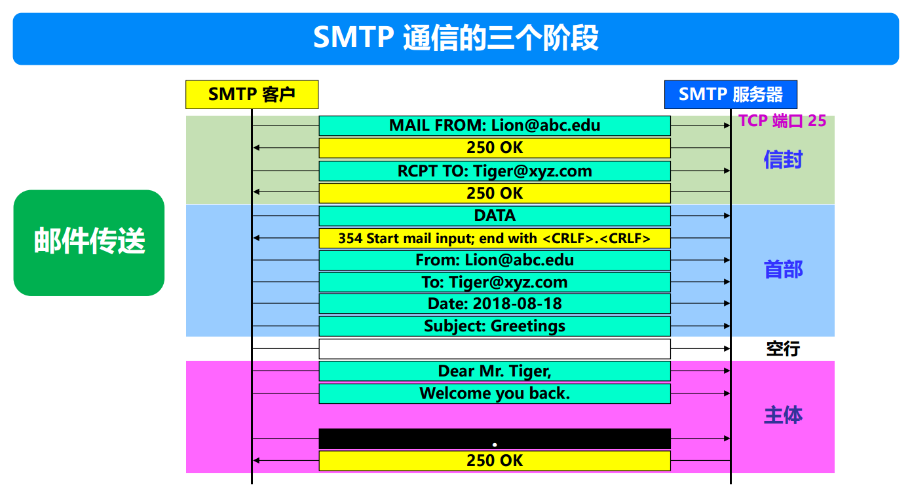
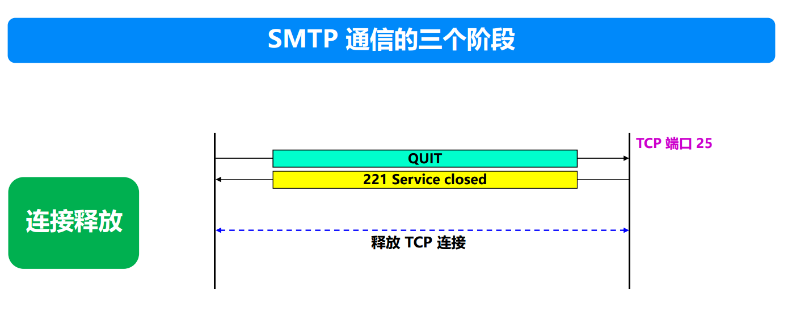

SMTP（**Simple Mail Transfer Protocol**，简单邮件传输协议）是电子邮件发送的标准协议，用于在发送方和接收方的邮件服务器之间传递邮件报文。以下是SMTP发送邮件过程的详细解释，包括各个步骤的功能和运行原理。

---

### **SMTP的特点**

1. **基于TCP**：
   - SMTP使用TCP协议，确保邮件传输的可靠性。
   - 默认端口号为25（也可以使用加密端口，如587或465）。

2. **面向队列的传输**：
   - 邮件在发送前后会被放入队列，SMTP负责传递邮件并确保成功。

3. **仅支持纯文本**：
   - SMTP原生支持ASCII文本。对于二进制附件（如图片或文档），需要通过**MIME（多用途互联网邮件扩展）**编码为文本。

4. **逐跳传输**：
   - 如果接收方邮件服务器不可达，邮件可能经过多个中间SMTP服务器传递到目标。

5. **双向通信**：
   - SMTP支持客户端和服务器之间的请求与响应机制，确保传输可靠。

---

### **SMTP相关的协议**

1. **POP3（Post Office Protocol v3）**：
   - 用于接收邮件。
   - 将邮件从邮件服务器下载到本地，通常是一次性下载，服务器上不会保留副本。

2. **IMAP（Internet Message Access Protocol）**：
   - 用于接收邮件。
   - 支持在线管理和多设备同步，服务器保留邮件副本。

3. **MIME（Multipurpose Internet Mail Extensions）**：
   - 扩展SMTP，允许传输非ASCII格式的数据（如图片、视频、附件）。

---

### **总结**
SMTP是用于邮件发送的核心协议，通过以下步骤完成邮件传输：
1. 用户通过用户代理发送邮件。
2. 发送方邮件服务器利用SMTP协议发送邮件。
3. 接收方邮件服务器接收并存储邮件。
4. 接收方通过POP3或IMAP协议访问邮件。
SMTP以其可靠性和普遍性成为电子邮件系统的核心协议。

设置**邮件服务器**而不是点对点发送邮件，是因为点对点直接发送存在许多技术、实际使用场景和效率上的限制。邮件服务器作为中间层，解决了点对点传输邮件所带来的问题，确保邮件服务的可靠性、灵活性和高效性。以下是详细的解释：

---

### **为什么不能点对点发送邮件？**

#### **1. 接收方的可用性问题**
- **接收方需要始终在线**：
  - 如果采用点对点传输方式，发送方必须在接收方**在线且邮件客户端运行**时发送邮件。
  - 但在实际情况下，接收方可能并不一直在线或者邮件客户端并未运行，这会导致邮件无法及时送达。
  - 邮件服务器可以解决这个问题，即使接收方暂时不在线，服务器仍然可以暂存邮件，等待接收方上线后递交邮件。

#### **2. 对发送方的负担**
- **重试发送的开销**：
  - 如果接收方暂时无法接收邮件（例如设备关机或网络中断），发送方就需要反复尝试重新发送，直到接收成功。这会大大增加发送方的时间成本和资源开销。
  - 而邮件服务器会接管这部分功能，将发送方与接收方的时间同步解耦。

---

### **邮件服务器的作用**

#### **1. 解耦发送方和接收方的连接状态**
- 邮件服务器可以作为邮件传输的中间节点：
  - **发送方**只需将邮件发送到自己的邮件服务器，无需关注接收方的在线状态。
  - **接收方**的邮件服务器负责接收邮件，即使接收方离线，也可以将邮件暂存，确保数据不会丢失。
  - 接收方上线时，再从邮件服务器中提取邮件。

#### **2. 确保邮件传输的可靠性**
- **邮件暂存功能**：
  - 邮件服务器在接收方服务器暂时无法访问时，可以缓存邮件。
  - 如果接收方的邮件服务器宕机或超载，发送方的邮件服务器会定期尝试重新发送，直到成功为止。

#### **3. 提高邮件传输的效率**
- **批量管理**：
  - 邮件服务器可以将多个邮件统一处理，例如批量转发或合并多个目标的连接请求，减少点对点通信的开销。
- **负载均衡**：
  - 通过集群邮件服务器，可以均衡负载，防止因并发邮件量过大而导致性能下降。

#### **4. 跨网络传输的技术支持**
- **DNS MX记录支持**：
  - 电子邮件的发送通常依赖域名系统（DNS）的**MX记录**来定位接收方的邮件服务器。如果没有邮件服务器，就无法实现这样的全局邮件传递。
  - 发送方的邮件服务器通过DNS查询，能够找到接收方的邮件服务器并建立连接。

#### **5. 提供安全性和管理功能**
- **反垃圾邮件功能**：
  - 邮件服务器通过反垃圾邮件策略（如检查黑名单、启用SPF/DKIM认证等）过滤邮件，保护用户免受垃圾邮件的侵扰。
- **病毒扫描**：
  - 邮件服务器可以扫描附件中的病毒或恶意内容。
- **日志管理**：
  - 邮件服务器可以记录每封邮件的发送和接收状态，便于审计和排查问题。

---

### **点对点发送邮件的劣势**

#### **1. 对用户硬件要求高**
- 接收方的设备需要**24/7不间断运行**，以保证随时能够接收邮件。这对于普通用户来说不现实，尤其是电力、网络和设备的连续运行成本高。
- 用户需要配置固定的公网IP地址，以便发送方能直接定位接收设备，而这对普通用户并不容易实现。

#### **2. 网络协议与性能问题**
- **传输协议复杂**：
  - 点对点传输需要用户终端直接支持SMTP协议，这要求用户自行部署复杂的网络协议栈和配置。
- **传输效率低**：
  - 如果有大量用户同时尝试发送邮件，会导致网络连接数激增，每一对点对点连接都需要占用资源，降低效率。

#### **3. 无法跨网络或防火墙**
- 用户终端可能受限于NAT、ISP防火墙或者动态IP地址，导致点对点连接难以建立。
- 邮件服务器通常部署在固定的公网IP地址下，能够轻松跨越这些障碍。

#### **4. 安全性不足**
- 点对点传输难以实施加密传输，容易遭受数据泄露、攻击或中间人劫持。
- 邮件服务器通常提供TLS加密和身份验证功能，确保传输安全。

---

### **总结：邮件服务器的优势**

| **功能需求**         | **点对点传输的限制**                           | **邮件服务器的解决方案**                       |
|-----------------------|-----------------------------------------------|-----------------------------------------------|
| **接收方在线状态**    | 需要接收方始终在线，无法存储离线邮件           | 接收方邮件服务器可暂存邮件，待接收方上线处理 |
| **发送方的发送开销**  | 发送方需要反复重试发送，耗费时间和资源         | 邮件服务器负责重试发送，降低发送方的负担     |
| **邮件传输效率**      | 每次点对点连接都需要独立建立和管理，效率低     | 邮件服务器批量处理连接，优化资源利用率       |
| **跨网络问题**        | NAT、防火墙和动态IP阻碍点对点通信              | 邮件服务器有固定公网IP地址，轻松跨越网络障碍 |
| **安全性**            | 难以保证传输加密，数据易泄露                  | 提供加密传输（如TLS），保障数据安全           |
| **管理功能**          | 缺乏病毒扫描、垃圾邮件过滤等功能               | 支持多种安全和管理功能，提供完整的邮件服务   |

---

### **现实中邮件服务器的角色**
1. **发送方邮件服务器**：
   - 发送方的邮件客户端首先将邮件提交到其邮件服务器。
   - 邮件服务器负责后续的传输，包括DNS查询和连接接收方服务器。

2. **接收方邮件服务器**：
   - 接收方邮件服务器接收邮件后暂存，等待接收方用户读取邮件。
   - 提供IMAP或POP3协议供用户下载或管理邮件。

3. **中继邮件服务器**：
   - 有时邮件会经过多个中间服务器（称为中继服务器）传递，确保邮件能够跨越不同网络到达目标。

---

### **结论**
邮件服务器的存在大幅提高了邮件传输的可靠性、灵活性和效率。相比点对点传输，邮件服务器解决了接收方离线状态、发送方重试开销、跨网络障碍等问题，同时提供了更好的安全性和管理功能。对于现代电子邮件系统而言，邮件服务器是不可或缺的核心组件。

---

在发送电子邮件时，如果遇到**发送失败**或**退信**（也称为“退回邮件”），可能由多个因素引起。这些错误可能与网络、邮件服务器、邮件客户端配置，甚至邮件内容相关。我们可以从以下几个方面来排查可能的问题：

### 1. **邮件服务器问题**
邮件发送的主要环节之一是通过邮件服务器（如 SMTP 服务器）来完成。如果邮件服务器无法正常工作，可能导致发送失败或邮件退回。常见的邮件服务器问题包括：
- **SMTP 服务器无法连接**：这可能是由于SMTP服务器地址错误、端口配置不正确（如端口25、465或587）或服务器无法访问（如服务器宕机或防火墙阻止了通信）。
- **认证失败**：如果SMTP服务器要求身份验证，但提供的用户名和密码错误，邮件将无法发送。
- **SMTP 服务器限制**：某些SMTP服务器可能限制了邮件的发送量、附件大小，或者禁止了来自某些IP地址或域名的发送请求。
  
### 2. **网络问题**
如果存在网络连接问题，邮件发送可能会失败。常见的网络问题包括：
- **网络中断**：如果你的设备与邮件服务器的连接被中断，邮件无法成功发送。
- **防火墙或安全软件**：防火墙、路由器或安全软件可能阻止SMTP端口的流量，导致邮件无法发送。
- **DNS解析问题**：邮件客户端在尝试连接到邮件服务器时，如果遇到DNS解析错误，无法找到邮件服务器的IP地址，就会导致邮件发送失败。

### 3. **收件人邮箱问题**
- **收件人邮箱地址错误**：如果收件人的电子邮件地址拼写错误（如缺少“@”符号、域名错误等），邮件将无法送达，通常会收到退信。
- **收件人邮箱已满**：如果收件人的邮箱容量已满，无法接收新的邮件，邮件将被退回。
- **收件人邮箱服务器拒收**：如果收件人邮箱服务器配置了过滤规则或黑名单，可能会拒绝接受你的邮件。例如，某些服务器可能会拒绝来自不可信的IP地址或域名的邮件。

### 4. **发件人邮箱问题**
- **发件人被标记为垃圾邮件源**：如果你的邮件域名或IP地址被列入垃圾邮件黑名单，邮件可能会被目标邮箱服务器拒绝或标记为垃圾邮件。
- **发件人邮箱设置问题**：如果你的邮箱账户存在配置错误，邮件可能无法发送。常见问题包括SMTP服务器设置不正确、发件人地址被屏蔽等。

### 5. **邮件内容问题**
- **邮件大小过大**：一些邮件服务器对附件的大小有限制。如果邮件超过了这个大小限制，邮件发送将失败。附件可能过大、邮件正文内容有大量嵌入图片或其他文件，都会导致邮件发送失败。
- **邮件内容被过滤为垃圾邮件**：有时邮件的主题、正文或附件格式可能触发反垃圾邮件系统的规则。例如，包含大量链接、可疑附件或关键词（如“免费”）可能导致邮件被判定为垃圾邮件。
- **邮件格式问题**：如果邮件格式不正确（如HTML格式错误、编码不匹配等），邮件可能无法发送。

### 6. **退信信息分析**
当你收到退信邮件时，邮件服务器通常会包含错误代码和失败原因。这些错误代码能够帮助你更精确地定位问题。常见的退信错误代码包括：
- **550：请求被拒绝**：通常表示发件人被收件人邮件服务器拒绝，可能是因为发件人被列入黑名单、邮件内容涉嫌垃圾邮件、或发件人的邮件地址无效。
- **421：服务不可用**：服务器临时无法处理邮件请求，可能是服务器忙碌或暂时不可达。
- **452：存储空间不足**：收件人的邮箱已满，无法接收新邮件。
- **554：垃圾邮件拒收**：邮件被收件人邮箱服务器标记为垃圾邮件。

### 7. **邮件客户端问题**
如果你使用的是电子邮件客户端（如 Outlook、Thunderbird、Apple Mail），客户端的配置问题也可能导致邮件发送失败。常见问题包括：
- **SMTP服务器设置错误**：SMTP服务器的地址或端口号不正确。
- **身份验证问题**：如果客户端未正确设置身份验证，或者密码错误，邮件将无法发送。
- **客户端软件错误**：客户端的缓存、配置文件损坏或版本问题也可能导致发送失败。

### **解决办法：**
- **检查SMTP设置**：确保邮件客户端中的SMTP服务器地址、端口和认证信息正确。
- **验证网络连接**：确保设备与互联网的连接正常，且防火墙或安全软件没有阻止SMTP端口的流量。
- **检查退信错误代码**：根据退信邮件中的错误代码，进一步分析问题所在。
- **检查邮箱配置**：确保发件人和收件人的邮箱都正常工作，收件人邮箱容量没有满。
- **检查邮件内容**：确保邮件大小适中，且邮件没有被误判为垃圾邮件。
- **使用其他邮箱**：尝试使用不同的邮箱或SMTP服务器进行发送，确认问题是否出在某个特定的服务提供商。

通过逐步排查上述原因，你可以找到邮件发送失败或退信的根本原因，并采取相应的解决措施。

---

