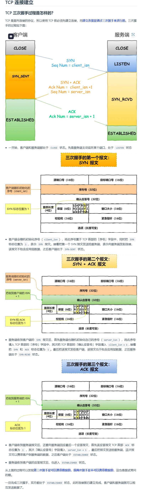
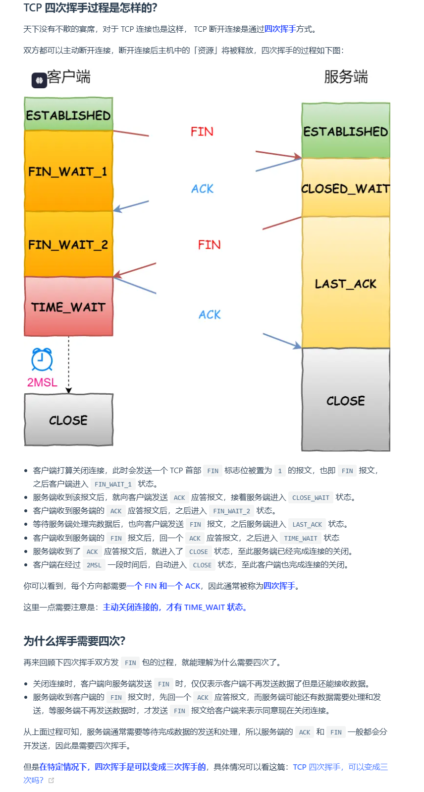

https://xiaolincoding.com/network/3_tcp/tcp_interview.html#tcp-%E4%B8%89%E6%AC%A1%E6%8F%A1%E6%89%8B%E8%BF%87%E7%A8%8B%E6%98%AF%E6%80%8E%E6%A0%B7%E7%9A%84

TCP（传输控制协议）和 UDP（用户数据报协议）是传输层协议，它们各自提供不同的服务，旨在实现端到端的数据传输。接下来，我将详细解释 TCP 和 UDP 提供的服务，并解释多路复用、多路分解、差错检验、可靠数据传输、面向连接的服务、拥塞控制等内容。

### 1. **TCP和UDP提供的服务：**

#### **TCP 提供的服务：**

1. **面向连接的服务（Connection-Oriented）**：
   - TCP 是一个面向连接的协议，这意味着在数据传输之前，必须先建立一个可靠的连接。连接的建立通常通过 **三次握手**（3-Way Handshake）过程来实现。
   - 在连接建立后，双方可以通过可靠的通道进行数据交换。在通信完成后，连接会通过 **四次挥手**（4-Way Handshake）来关闭。

2. **可靠数据传输（Reliable Data Transfer）**：
   - TCP 提供可靠的数据传输服务，确保数据包能够顺利从发送方传输到接收方。这是通过以下机制实现的：
     - **数据确认（ACK）**：接收方会确认收到的数据，如果发送方在一定时间内没有收到确认，数据会被重新发送。
     - **序列号和重传机制**：TCP 为每个数据包分配一个序列号，用于标识数据包的顺序。接收方根据序列号将数据重组，确保数据的顺序正确。如果数据包丢失或出现错误，发送方会重新传输丢失的数据包。
     - **超时重传（Timeout Retransmission）**：如果在一定时间内没有收到确认，发送方会认为数据包丢失并重传。

3. **流量控制（Flow Control）**：
   - 流量控制通过 **滑动窗口机制**（Sliding Window）来实现。接收方告诉发送方它的接收缓冲区大小，发送方根据这个大小控制发送的数据量，避免接收方的缓冲区溢出。

4. **拥塞控制（Congestion Control）**：
   - 拥塞控制是 TCP 的一个重要特性，它通过动态调整发送速率来避免网络拥塞。主要的拥塞控制机制有：
     - **慢启动（Slow Start）**：开始时，TCP 的发送窗口非常小，每经过一个往返时间（RTT）后，发送窗口指数增长。
     - **拥塞避免（Congestion Avoidance）**：一旦发生丢包，TCP 会进入拥塞避免阶段，减少发送窗口的大小，避免过度拥塞。
     - **快速重传和快速恢复（Fast Retransmit and Fast Recovery）**：如果 TCP 收到三个相同的确认号（重复 ACK），它会认为发生了丢包，并快速重传丢失的数据包，同时恢复拥塞窗口的大小。

5. **顺序数据传输**：
   - TCP 保证数据按顺序到达。即使数据包在网络中乱序传输，TCP 也会根据序列号重新排列数据，确保数据正确顺序交付给上层应用。

6. **差错检测（Error Checking）**：
   - TCP 使用 **校验和**（Checksum）机制来检测数据传输中的错误。每个数据段都带有一个校验和，接收方对数据进行校验，如果发现错误则丢弃该数据段。

#### **UDP 提供的服务：**

1. **无连接服务（Connectionless）**：
   - UDP 是一个无连接的协议，意味着在数据传输之前不需要建立连接。每个数据报文是独立的，UDP 不保证数据传输的可靠性或顺序。
   
2. **不可靠的数据传输（Unreliable Data Transfer）**：
   - UDP 不提供数据确认机制，数据包可能丢失、重复或乱序到达。它仅提供最基本的传输功能，不进行重传、顺序保证或错误恢复。

3. **低延迟**：
   - 由于 UDP 没有 TCP 的连接建立和可靠性控制，它的开销较小，适合实时应用，如视频会议、语音通信、在线游戏等。

4. **差错检测**：
   - UDP 也使用 **校验和** 来检查数据在传输过程中是否出现错误，但它没有重传机制，因此错误的数据会被丢弃。

5. **无拥塞控制**：
   - UDP 没有内置的拥塞控制机制，发送方可以以最大速度发送数据，可能导致网络拥塞，适合对丢包容忍的应用。

### 2. **多路复用和多路分解**

#### **多路复用（Multiplexing）**：
- **概念**：多路复用是指在源主机上，多个应用程序的不同数据流通过同一个网络连接进行传输。在传输层，每个应用程序（如浏览器、邮件客户端等）通过不同的端口号来区分。
- **过程**：当多个应用程序向同一网络发送数据时，传输层会将不同应用的数据封装成数据块（数据段）。每个数据段包含源端口号和目标端口号，确保数据能够准确地发送到正确的应用程序。最终，这些数据块被放入网络层的 IP 数据包中。

#### **多路分解（Demultiplexing）**：
- **概念**：多路分解是接收方将收到的数据段传递给正确的应用程序的过程。接收方通过检查数据段中的目标端口号来判断哪个应用程序应该接收该数据段。
- **过程**：在接收方，传输层根据每个数据段中的目标端口号将数据分发给相应的应用程序（即套接字）。这就是多路分解的过程，确保不同的应用程序能够正确地接收和处理数据。

### 3. **差错检验功能**

- **差错检测机制**：无论是 TCP 还是 UDP，都使用校验和（Checksum）来检测数据传输过程中的错误。校验和是通过对数据进行简单的数学计算，生成一个值，并附加到数据段中。接收方使用相同的算法计算校验和，并与数据段中的校验和进行比较。如果两者不匹配，表示数据在传输过程中出现了错误，接收方会丢弃该数据段。

### 4. **TCP 的附加服务**

除了基本的传输功能，TCP 还提供了一些附加的服务，确保数据传输的可靠性、顺序和效率。

- **可靠数据传输**：通过确认、序列号、重传机制等，确保数据准确、完整地到达接收方。
- **流量控制**：通过滑动窗口机制，防止接收方的缓冲区溢出。
- **拥塞控制**：通过动态调整发送速率，避免网络出现拥塞。
- **面向连接的通信**：通过三次握手建立连接，确保双方通信的可靠性。

### 总结

- **TCP** 提供了 **面向连接**、**可靠传输**、**流量控制**、**拥塞控制**等服务，适合需要高可靠性和顺序保证的应用（如文件传输、网页浏览等）。
- **UDP** 提供了 **无连接**、**不可靠**、**低延迟** 的服务，适合实时应用和容忍一定丢包的场景（如视频流、VoIP 等）。
- **多路复用** 和 **多路分解** 使得多个应用程序可以通过单一的网络连接进行通信，传输层根据端口号区分不同的数据流。
- **差错检验** 确保数据在传输过程中不会出现错误，TCP 和 UDP 都使用校验和来检测数据的完整性。

这些机制和服务的实现使得 TCP 和 UDP 能够满足不同网络应用对可靠性、效率和实时性的不同需求。

三次握手（3-Way Handshake）是 TCP 协议中建立连接的必需过程，它不仅仅是一个“形式”，而是为了确保可靠的连接和正确的通信。下面我将解释为什么三次握手是必要的，重点是在**同步序列号**、**连接确认**、**避免旧连接干扰**等方面。

### 1. **确保双方都准备好建立连接**
在三次握手的过程中，客户端和服务器都能确认对方的存在和准备状态。

- **第一次握手**：客户端发送 **SYN** 包（同步标志），表示客户端请求建立连接，并随机选择一个初始序列号。这是客户端告诉服务器，它准备好开始连接了。
  
- **第二次握手**：服务器收到客户端的 **SYN** 包后，回复一个 **SYN + ACK** 包，表示服务器已经准备好并且同意建立连接。它还会带上一个序列号，用于与客户端的序列号进行同步。

- **第三次握手**：客户端接收到服务器的 **SYN + ACK** 包后，向服务器发送一个确认的 **ACK** 包，确认服务器的响应并将连接建立完成。

这个过程确保了双方都明确了连接的状态，避免在一个半开放的状态下进行数据传输。

### 2. **同步序列号**
TCP 是一个 **面向字节流** 的协议，每个字节都有一个序列号。为了确保数据按序传输，双方必须对序列号进行同步，三次握手确保了这一点。

- **客户端的 SYN 包**：客户端在第一次握手中选择一个初始序列号（`seq = x`），并发送给服务器。
- **服务器的 SYN + ACK 包**：服务器接收到客户端的 SYN 包后，选择自己的初始序列号（`seq = y`）并发送一个带有确认号（`ack = x + 1`）的 SYN 包。这个确认号是对客户端初始序列号的确认。
- **客户端的 ACK 包**：客户端接收到服务器的 SYN + ACK 包后，发送一个带有确认号（`ack = y + 1`）的 ACK 包，表示确认接收到服务器的序列号。

通过这种方式，双方交换并同步了各自的初始序列号，确保数据的正确顺序，并且避免了因序列号不一致而导致的通信混乱。

### 3. **避免旧连接的干扰**
在计算机网络中，连接建立和断开后，连接的状态可能会长时间保存在网络中。比如，某些网络设备（如路由器、NAT 网关）可能缓存连接信息，旧连接的包可能会在一段时间后到达。三次握手可以有效避免这种情况。

- 在第一次握手时，客户端通过发送 SYN 包标识它要建立连接。如果客户端没有收到来自服务器的确认，连接不会建立。
- 第二次握手中，服务器通过 **SYN + ACK** 包回应客户端，表示自己准备好连接。只有在接收到确认后，客户端才会发出最终的 ACK 包。

这种机制避免了因旧的连接状态（例如，某个旧的 SYN 包或者 ACK 包）干扰当前连接建立的问题。通过三次握手，确保了在连接建立前，双方都确认了对方的准备状态，避免了因网络延迟或缓存等因素引起的连接问题。

### 4. **保证可靠的连接建立**
三次握手确保了 **双方都知道连接是否已经建立**。如果少了任何一步，连接可能无法可靠地建立。

- 如果只有两次握手，客户端可能在没有得到服务器确认的情况下就认为连接已建立，从而开始发送数据，导致数据丢失。
- 三次握手确保了 **双方都已经交换并确认了连接的状态**，防止连接未成功建立就开始传输数据。

### 5. **防止资源浪费**
在没有三次握手的情况下，可能存在客户端发送数据而没有真正建立连接的情况。这会导致网络资源的浪费（如带宽、服务器资源等）。三次握手可以确保在数据传输之前，双方都明确知道连接已经建立，并且开始传输数据。通过这个过程，避免了无用的资源浪费。

### 6. **保障数据的正确性和顺序**
通过三次握手，连接的双方确保了传输的数据能够被按正确的顺序接收。每次数据包都会有一个 **序列号**，并且每个包的确认也基于这个序列号。通过建立一个可靠的连接，TCP 能够保证数据不会丢失、重复，且能够按顺序交付到接收方。

### 总结：
三次握手是 TCP 连接建立的必要步骤，主要有以下几个原因：
1. **确保双方准备好建立连接**：客户端和服务器通过握手确保双方都已经准备好开始通信。
2. **同步序列号**：确保数据传输时，双方的序列号正确同步，以便按顺序传输数据。
3. **避免旧连接干扰**：三次握手可以有效避免旧的连接信息干扰当前的连接建立。
4. **防止资源浪费**：确保只有在连接成功建立后，双方才开始传输数据，避免无效连接消耗资源。
5. **保障数据的正确性**：通过交换确认信息和同步序列号，确保数据按正确顺序传输。

这些都是 TCP 实现 **可靠性** 和 **顺序保证** 的基础。

TCP 需要 **四次挥手**（4-Way Handshake）来断开连接，这是因为 TCP 是 **全双工**（full-duplex）通信协议，意味着数据可以同时在两个方向上传输。每一方都可能有自己独立的数据需要传输，因此在关闭连接时，必须分别关闭每个方向的通信通道，而不是一次性关闭整个连接。这就需要四个步骤来确保每个方向的数据都被正确地传输完毕，并且连接得以有序关闭。

### 为什么需要四次挥手？
1. **TCP 是全双工的**：
   - 在 TCP 连接中，通信是双向的，客户端和服务器都可以同时发送和接收数据。因此，断开连接时，双方必须分别关闭各自的发送和接收通道，而不能仅仅依赖单一的断开操作。

2. **保证数据完整性**：
   - 由于双方可能还有未传输完的数据（例如客户端正在发送数据而服务器还未完全接收），四次挥手可以确保双方在关闭连接之前完成所有数据的传输。

### 四次挥手的过程
四次挥手分为四个步骤，目的是确保每一方的连接都能优雅地关闭，且没有数据丢失。以下是每个步骤的详细说明：

#### 1. **客户端发送 FIN 包，表示关闭连接**
   - 客户端没有数据要发送，想要断开与服务器的连接，首先向服务器发送一个 **FIN**（finish）包。这是连接关闭的 **主动发起方**。
   - 此时客户端仍然可以接收数据，但它已经不再发送数据了。
   - 客户端在 **FIN** 包中携带自己的序列号 `u`，表示这是一个终止连接的请求。

   **客户端 → 服务器**：`FIN, seq = u`

#### 2. **服务器响应 ACK 确认客户端的 FIN 包**
   - 服务器接收到客户端的 **FIN** 包后，确认客户端关闭连接的请求，并回复一个 **ACK**（确认）包，表示已经收到了客户端的关闭连接请求。
   - 服务器在 **ACK** 包的确认号字段中填入 `u + 1`（即客户端的序列号加 1）。
   - 这时，服务器依然保持着连接，它可以继续发送数据给客户端，直到它也准备好关闭连接。

   **服务器 → 客户端**：`ACK, seq = v, ack = u + 1`

#### 3. **服务器发送 FIN 包，表示自己也要关闭连接**
   - 服务器发送完 **ACK** 包后，如果它没有数据要发送了，也会向客户端发送 **FIN** 包，表示它也没有更多数据需要传输，并请求关闭连接。
   - 服务器会选择自己的序列号（例如 `v`）并将其放入 **FIN** 包中。

   **服务器 → 客户端**：`FIN, seq = v`

#### 4. **客户端响应 ACK，确认关闭**
   - 客户端收到服务器的 **FIN** 包后，确认服务器的关闭请求，并发送一个 **ACK** 包作为回应。此时，客户端将服务器的序列号 `v` 加 1 作为确认号 `ack = v + 1`。
   - 这样，双方确认了连接的关闭。此时，客户端进入 **TIME_WAIT** 状态，等待足够的时间以确保 **ACK** 包能够可靠到达服务器，防止丢包。

   **客户端 → 服务器**：`ACK, seq = u + 1, ack = v + 1`

#### 5. **TIME_WAIT 状态**
   - 客户端在发送完 **ACK** 包后并不会立即关闭连接，而是进入 **TIME_WAIT** 状态，通常会保持 **2MSL**（Maximum Segment Lifetime）时间，这段时间通常为 2 到 4 分钟，目的是：
     - 确保服务器收到客户端的 **ACK** 包。因为如果最后的 **ACK** 包丢失，服务器会在超时后重新发送 **FIN** 包，客户端就能再次确认它。
     - 确保连接中的老旧数据包不会干扰未来的连接（避免重用旧的序列号）。

   客户端在 **TIME_WAIT** 状态结束后，才会完全关闭连接。

### 为什么需要四次挥手而不是两次？
四次挥手的必要性，主要与 TCP 的 **全双工** 特性和 **数据传输完成的保证** 有关。简要来说：

1. **全双工通信**：
   - 由于 TCP 是全双工的连接，客户端和服务器的数据流是独立的。即便客户端发起了连接关闭请求，它仍然可以等待服务器完成数据的传输，直到确认服务器也不再需要发送数据。
   - 在关闭连接时，客户端和服务器的发送通道必须分别关闭，这就是为什么每方都需要各自发送和确认 `FIN` 包的原因。

2. **保证数据的完整传输**：
   - 在第一次 **FIN** 发送时，客户端实际上还可以接收数据，直到服务器关闭连接。服务器可能还有未完成的数据发送，必须等到它传输完这些数据后才能关闭连接。
   - 如果只用两次挥手，客户端和服务器的发送通道可能会在数据还未完全传输完时就关闭，这会导致数据丢失。
   
3. **避免连接中断时的数据丢失**：
   - 通过四次挥手的方式，双方可以确保在完全关闭连接之前，所有数据都已经正确传输完毕。

### 总结
**四次挥手**是为了保证 **TCP 连接的可靠、优雅关闭**。每一方都需要独立关闭自己的发送通道，并确保对方确认接收到连接关闭的请求。这是因为 TCP 连接是全双工的，每个方向都可能有独立的数据传输，因此每个方向都需要被分别关闭，确保所有数据都传输完毕，连接能正确释放。通过四次挥手的过程，确保双方都能正确关闭连接，避免数据丢失或连接不完全中断的问题。

在 **TCP（传输控制协议）** 中，可靠的数据传输是通过一系列机制实现的，确保数据能够按序、完整地传输并且能够应对网络中的各种问题。TCP 协议中的 **发送方** 和 **接收方** 各自有不同的特点，特别是在数据传输中的处理机制。我们可以从两方面来详细解释它们的工作原理：发送方的特点以及接收方如何处理错误或乱序的数据包。

### **发送方的特点**

1. **单一计时器（Retransmission Timer）**：
   - **描述**：发送方通常只为 **最早发送但尚未确认** 的报文段设置计时器。当这个报文段的 **超时** 到达时，发送方会重新发送这个报文段。
   - **作用**：通过重传机制确保丢失的分组最终会被重新传输，增加数据传输的可靠性。

2. **发送缓存和窗口机制**：
   - **描述**：发送方维护一个发送缓存（即发送队列），并且使用 **滑动窗口** 来控制能够发送的最大数据量。
   - **作用**：在流量控制机制下，发送方可以根据接收方的接收窗口大小来调整发送速率，并确保不会超出接收方的接收能力。

3. **快速重传（Fast Retransmit）**：
   - **描述**：当发送方收到 **三个重复的 ACK**（即接收方对相同的序列号多次确认）时，发送方会认为某个分组丢失并立即进行重传，而不必等待定时器超时。
   - **作用**：这种机制能够在丢包的情况下减少延迟，因为它减少了等待超时的时间，使数据恢复更迅速。

4. **流量控制（Flow Control）**：
   - **描述**：发送方通过 **接收方的窗口大小**（在 TCP 报文头中的窗口字段）来控制发送速率，确保接收方有足够的缓存空间接收数据，防止接收方被数据淹没。
   - **作用**：流量控制机制能够避免发送方超出接收方的接收能力，防止数据丢失。

5. **拥塞控制（Congestion Control）**：
   - **描述**：发送方能够感知网络中的拥塞程度，并根据网络的拥塞状况调整数据发送速率。TCP 使用几种算法来控制拥塞，最著名的包括 **慢启动**、**拥塞避免**、**快速恢复** 和 **快速重传**。
   - **作用**：通过动态调整发送窗口大小，避免网络发生拥塞，确保网络资源的有效利用。

6. **应答机制（Acknowledgment Mechanism）**：
   - **描述**：发送方每发送一个报文段，都会等待接收方发送一个确认报文（ACK），确认接收方已经成功接收到该分组，且无丢失或损坏。
   - **作用**：保证数据的可靠传输，接收方的每一个 ACK 代表一个已成功接收的序列号，从而确保每个报文段都被正确传输。

### **接收方的特点**

1. **接收缓存和窗口机制**：
   - **描述**：接收方维护一个接收缓存，用来存储接收到的报文段。接收方的窗口控制机制可以根据接收方的接收能力（即接收窗口的大小）告诉发送方它可以继续发送多少数据。
   - **作用**：接收缓存确保接收方有足够的空间存储接收到的数据，接收窗口控制则保证接收方不会被过多数据淹没。

2. **累积确认（Cumulative Acknowledgment）**：
   - **描述**：接收方使用 **累积确认**，即它总是确认到目前为止所有按序收到的报文段。接收方并不会单独确认每一个报文段，而是只确认到 **当前接收窗口中期望的下一个报文段** 的序列号。
   - **作用**：累积确认能够减少确认报文的数量，提高效率。同时，也表明接收方已经按序成功接收了所有序列号小于确认号的报文段。

3. **处理错误的分组**：
   - **描述**：如果接收方收到的数据包 **有错误**（例如校验和错误），它会丢弃这个分组，并且 **不会发送 ACK**，或者它可能会对上次确认过的分组进行重新确认。
   - **作用**：接收方通过不确认错误的数据包来让发送方知道这个数据包没有被正确接收，从而促使发送方重发这个数据包。

4. **处理乱序的分组**：
   - **描述**：如果接收方收到的数据包 **乱序**（即不是按序号递增的），接收方会将这些乱序数据包存储在接收缓存中，并继续确认它已经按序接收到的上一个分组的序号。接收方不会立刻丢弃这些乱序的数据包，而是缓存它们，直到前面的分组到达。
   - **作用**：缓存乱序的数据包直到缺失的分组到达，这样可以避免丢弃有用数据，直到接收方能够将这些分组按正确的顺序交给上层应用。

5. **重新确认（Re-Acknowledgment）**：
   - **描述**：接收方会对 **最近一次确认过的分组** 进行重新确认。即使接收方收到一个乱序的分组，它也会对 **之前确认过的序列号** 发送重复的 ACK。
   - **作用**：这种机制帮助发送方在收到重复的 ACK 后知道它应该重传丢失的分组。

### **接收方如何处理错误和乱序的数据包**

- **错误数据包**：
  - 接收方在收到错误数据包时（例如校验和错误），它不会发送确认，或者它会 **重新确认** 最后一个成功接收到的数据包。这意味着发送方会知道某个数据包发生了错误，需要重新传输。

- **乱序数据包**：
  - 接收方在收到乱序的数据包时，会将其缓存，并继续确认它已经按序接收到的最后一个分组。接收方不会立即丢弃乱序的数据，而是等待缺失的分组到达。一旦缺失的分组到达，接收方会将缓存的乱序数据包交给上层应用。

---

### **总结**

**发送方**的特点：
- 发送缓存、滑动窗口、单一计时器、快速重传、流量控制、拥塞控制等机制保证了数据的可靠、高效传输。
- 发送方确保每个数据包的传输都得到接收方的确认，并且能够在网络丢包、延迟等情况下进行处理。

**接收方**的特点：
- 接收缓存、累积确认、乱序缓存等机制帮助接收方按序接收并确认数据。
- 如果接收方收到错误数据，它会丢弃该数据包并进行重新确认；如果收到乱序数据包，它会缓存乱序的数据直到按序的分组到达。

这些特点共同确保了 TCP 在不可靠的网络环境下仍能提供可靠的数据传输服务。