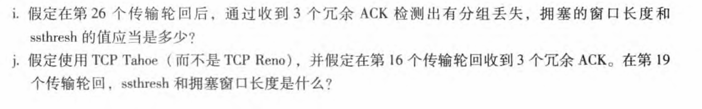
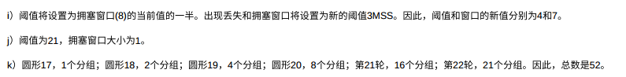

---

https://blog.csdn.net/weixin_69884785/article/details/135743928

### **TCP Reno和TCP Tahoe的区别**

TCP Reno和TCP Tahoe都是实现TCP拥塞控制的算法，主要用于处理网络拥塞、避免数据丢失，并确保可靠的数据传输。虽然它们都遵循**慢启动**、**拥塞避免**、**快速重传**和**快速恢复**等机制，但它们在应对数据丢失时的处理方式有所不同。下面是TCP Reno和TCP Tahoe的主要区别：

---

### **1. 快速重传与快速恢复机制的处理方式**

#### **TCP Tahoe：**
- **快速重传（Fast Retransmit）：** TCP Tahoe会在收到三个重复的ACK时立即重传丢失的数据包，认为网络出现了拥塞。
- **快速恢复（Fast Recovery）：** TCP Tahoe **没有**快速恢复机制。当TCP Tahoe检测到数据丢失时，进入**慢启动**阶段，并重置**拥塞窗口（cwnd）** 为1个MSS（最大报文段长度）。
  
  **具体步骤：**
  - 当发生丢包时（即接收到三个重复ACK），TCP Tahoe会立即触发**快速重传**。
  - 然后，它会将**cwnd**设置为1（进入慢启动阶段），并重新开始慢启动过程。

#### **TCP Reno：**
- **快速重传（Fast Retransmit）：** 和TCP Tahoe一样，TCP Reno在接收到三个重复的ACK时，会立即重传丢失的数据包。
- **快速恢复（Fast Recovery）：** 与TCP Tahoe不同，TCP Reno在发生丢包时会进入**快速恢复阶段**，而不是重新进入慢启动。具体来说：
  - **cwnd**不会被重置为1，而是被设置为丢失数据段之前**cwnd的一半**。
  - **ssthresh**（慢启动阈值）也会设置为**cwnd的一半**。
  - 然后，TCP Reno会继续在**拥塞避免阶段**（即线性增长cwnd）进行数据传输，直到收到新的ACK确认。

---

### **2. 拥塞窗口（cwnd）的调整策略**

#### **TCP Tahoe：**
- **丢包时的调整：**
  - 当TCP Tahoe检测到丢包（通过超时或者三个重复ACK）时，**cwnd**会被**重置为1**，然后进入慢启动阶段，重新开始数据传输的探测过程。
  
  - **慢启动过程：** `cwnd`开始时为1，逐渐指数增长（每收到一个ACK，`cwnd`翻倍），直到达到慢启动阈值（ssthresh），然后切换到拥塞避免阶段。

#### **TCP Reno：**
- **丢包时的调整：**
  - TCP Reno在接收到三个重复ACK时，不会将`cwnd`重置为1，而是将其设置为**ssthresh**的大小，即当前`cwnd`的一半，进入快速恢复阶段。然后，`cwnd`会线性增长，直到网络稳定。
  
  - **慢启动阶段与拥塞避免阶段：**
    - **慢启动阶段**：`cwnd`从1开始，每次成功接收一个ACK时指数增长。
    - **拥塞避免阶段**：`cwnd`线性增长，每次ACK到达时，`cwnd`增加1。

---

### **3. 慢启动阈值（ssthresh）的处理**

#### **TCP Tahoe：**
- **慢启动阈值（ssthresh）：**
  - 在TCP Tahoe中，当发生丢包时，**ssthresh**会被设置为**cwnd的一半**，然后进入慢启动阶段，`cwnd`重新从1开始增长。
  
  - 这一过程导致TCP Tahoe在丢包发生后会经历较长时间的慢启动和拥塞避免阶段。

#### **TCP Reno：**
- **慢启动阈值（ssthresh）：**
  - 与TCP Tahoe一样，TCP Reno在丢包时也会将**ssthresh**设置为**cwnd的一半**。
  - 但是，TCP Reno的**cwnd**不会被重置为1，而是被设置为ssthresh，进入快速恢复阶段后进行**线性增长**。
  
  - 由于TCP Reno能够在拥塞恢复后继续传输数据，因此它能够更快地恢复传输速度，避免在发生丢包后退回到慢启动阶段，从而提升性能。

---

### **4. 性能对比**

- **TCP Tahoe：** 在发生丢包时，TCP Tahoe会将`cwnd`重置为1，导致丢包后的恢复较慢，网络利用率不高，尤其是在高丢包率环境下。
- **TCP Reno：** 在发生丢包时，TCP Reno通过快速恢复机制，避免了重置`cwnd`为1的开销，因此能够更快地恢复网络传输，提供更高的网络吞吐量，特别是在低到中等丢包率环境下。

---

### **总结：**

| **特性**                | **TCP Tahoe**                         | **TCP Reno**                         |
|-------------------------|---------------------------------------|--------------------------------------|
| **丢包后的窗口调整**       | 重置`cwnd`为1，进入慢启动              | `cwnd`设置为ssthresh，进入快速恢复    |
| **快速恢复机制**         | 无快速恢复，丢包后回到慢启动           | 支持快速恢复，避免完全回到慢启动     |
| **拥塞控制恢复速度**       | 慢启动阶段较长，恢复较慢                | 快速恢复后继续线性增长，恢复较快     |
| **性能**                | 在丢包较严重时性能较差                 | 性能较好，尤其是在低到中等丢包率时   |

### **总结**
- **TCP Tahoe**是较早的TCP拥塞控制算法，简单易懂，但在丢包时会造成网络恢复速度较慢。
- **TCP Reno**是在TCP Tahoe的基础上改进的算法，通过引入**快速恢复机制**，在发生丢包时能够快速恢复，提升了网络的吞吐量和恢复速度。