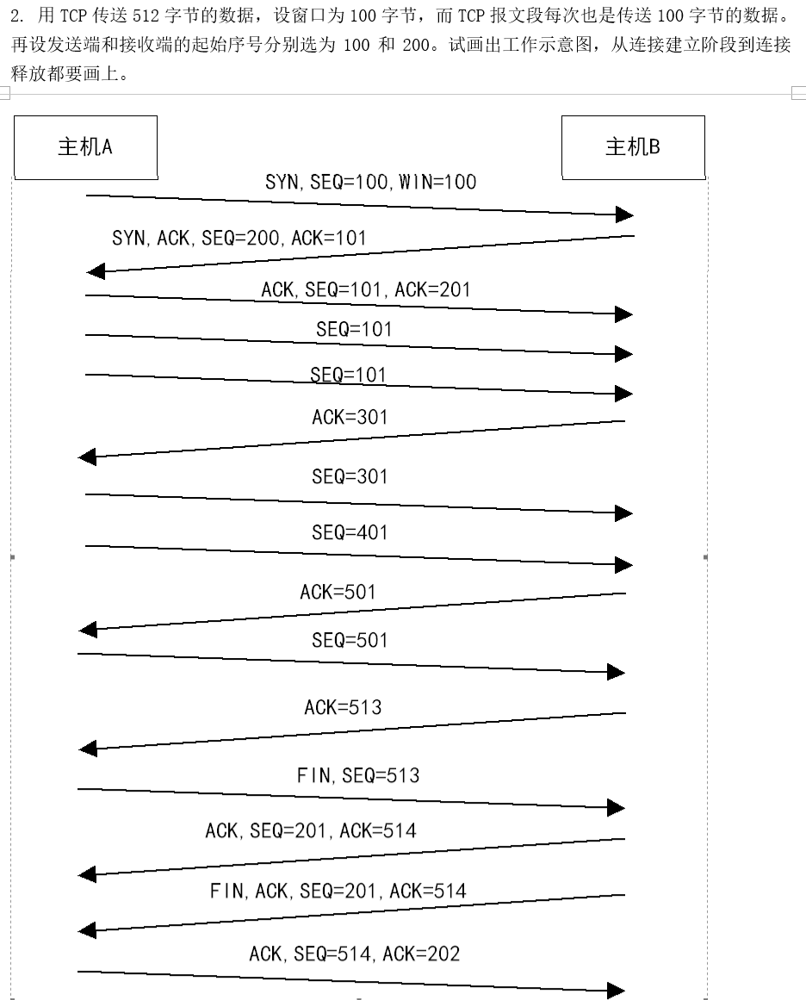

这个问题涉及到 TCP 连接的最大数据率的计算，其中给出了以下信息：
- 每个报文段的最大长度是 128 字节。
- 序号使用 8 位表示（即可以表示 0 到 255 之间的数字）。
- 报文段在网络中的寿命为 30 秒。

目标是计算每条 TCP 连接在这种限制下能达到的 **最高数据率**。

### 1. 序号的作用

首先，TCP 协议中每个报文段都有一个 **序号**。这个序号是一个 32 位的数字，用于标识每个字节的数据，确保接收方能够按正确的顺序重组接收到的数据。在这个问题中，题目给出的序号是 **8 位**，这意味着每个 TCP 连接可以支持最多 **256** 个不同的序号（因为 8 位能表示的数字范围是 0 到 255）。

然而，序列号是 **循环使用的**，即当序列号达到最大值（255）后，它会重新回到 0。因此，在 **30 秒内**，发送方发送的报文段数量不能超过 255 个，因为 **在 30 秒内，序列号必须唯一且不重复**，直到网络中的所有报文段都从网络中消失。

### 2. 计算最大报文段数

题目指出报文段的寿命是 **30 秒**，所以在这 30 秒内，网络中的每个报文段必须在其序列号循环回来之前消失。为了确保报文段不重复使用序列号，**在 30 秒内最多能发送 255 个报文段**，每个报文段的序列号唯一。

### 3. 计算最大数据量

每个报文段的最大长度为 **128 字节**。由于 1 字节 = 8 位，因此每个报文段的大小为：

$$
128 \text{ 字节} \times 8 \text{ 位/字节} = 1024 \text{ 位}
$$

因此，30 秒内最多可以发送 255 个报文段，每个报文段的大小为 1024 位。所以，30 秒内能够传输的最大总数据量是：

$$
255 \text{ 个报文段} \times 1024 \text{ 位/报文段} = 261120 \text{ 位}
$$

### 4. 计算最大数据率

数据率是单位时间内传输的数据量。这里的单位时间是 **30 秒**，所以最大数据率是：

$$
\frac{261120 \text{ 位}}{30 \text{ 秒}} = 8704 \text{ 位/秒} = 8.704 \text{ Kb/s}
$$

### 5. 结论

因此，在给定的条件下，TCP 连接的 **最高数据率** 为 **8.704 Kb/s**。

### 解释过程总结：

1. **序号限制**：由于序号使用 8 位，最多只能表示 255 个不同的序号，意味着在 30 秒内最多发送 255 个报文段。
2. **报文段大小**：每个报文段的最大大小为 128 字节（1024 位），因此 30 秒内最多传输 255 × 1024 位。
3. **数据率计算**：将总数据量除以 30 秒，得到最大数据率为 8.704 Kb/s。

这个过程的关键是考虑序列号的循环和每个报文段的最大长度，以确保在 30 秒内不会有重复的序列号，同时计算出 TCP 连接的最大数据率。

---

SEQ + 1 -> ACK
ACK -> SEQ 

这张图展示了一个TCP连接的建立、数据传输和连接终止的过程。以下是详细解释：

### 连接建立（三次握手）

1. **SYN, SEQ=100, WIN=100**:
   - 主机LA向主机LB发送SYN（同步）报文，初始序列号（SEQ）为100，窗口大小（WIN）为100。

2. **SYN, ACK, SEQ=200, ACK=101**:
   - 主机LB收到SYN后，发送SYN和ACK（确认）报文，初始序列号为200，确认号（ACK）为101（表示期望收到的下一个字节序号）。

3. **ACK, SEQ=101, ACK=201**:
   - 主机LA收到SYN, ACK后，发送ACK报文，序列号为101，确认号为201，完成三次握手，连接建立。

### 数据传输

- **SEQ=101**:
  - 主机LA发送数据，序列号为101。

- **ACK=301**:
  - 主机LB确认收到数据，发送ACK报文，确认号为301。

- **SEQ=301**:
  - 主机LA继续发送数据，序列号为301。

- **SEQ=401**:
  - 主机LA继续发送数据，序列号为401。

- **ACK=501**:
  - 主机LB确认收到数据，发送ACK报文，确认号为501。

- **SEQ=501**:
  - 主机LA继续发送数据，序列号为501。

- **ACK=513**:
  - 主机LB确认收到数据，发送ACK报文，确认号为513。

### 连接终止（四次挥手）

1. **FIN, SEQ=513**:
   - 主机LA发送FIN（终止）报文，序列号为513，表示请求关闭连接。

2. **ACK, SEQ=201, ACK=514**:
   - 主机LB确认收到FIN，发送ACK报文，序列号为201，确认号为514。

3. **FIN, ACK, SEQ=201, ACK=514**:
   - 主机LB发送FIN和ACK报文，序列号为201，确认号为514，表示同意关闭连接。

4. **ACK, SEQ=514, ACK=202**:
   - 主机LA确认收到FIN，发送ACK报文，序列号为514，确认号为202，连接关闭。

这个过程展示了TCP协议的可靠性和有序性，确保数据的完整传输和连接的正常关闭。
