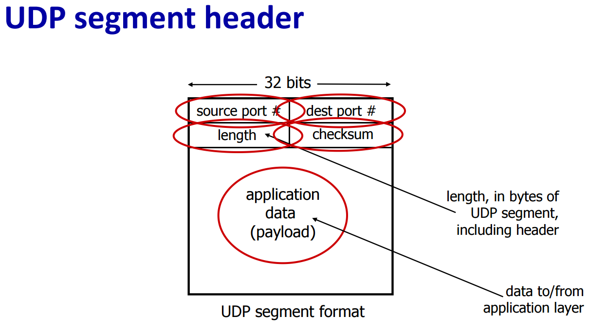

UDP（用户数据报协议）本身不包含IP地址信息，因为它是传输层协议，依赖于网络层（IP协议）来处理IP地址的传输。UDP数据报在传输时，IP协议会将源IP地址和目标IP地址封装在IP数据包的头部中。以下是UDP数据传输的过程：

1. **应用层生成数据**：应用程序生成需要发送的数据，并通过套接字接口将数据传递给UDP协议。

2. **UDP封装数据**：UDP协议将应用层数据封装在UDP数据报中，并添加UDP头部信息，包括源端口号、目标端口号、长度和校验和。

3. **IP协议封装**：UDP数据报被传递到网络层，IP协议将其封装在IP数据包中，并添加IP头部信息，包括源IP地址和目标IP地址。

4. **路由传输**：IP数据包通过网络传输，路由器根据目标IP地址将数据包转发到目标网络。

5. **接收端解封装**：目标主机接收到IP数据包后，网络层解封装出UDP数据报，并将其传递给传输层。

6. **UDP解复用**：UDP协议根据目标端口号将数据报交给相应的应用程序进行处理。

通过这种方式，UDP能够在不直接处理IP地址的情况下，依赖IP协议实现数据的传输。

---


UDP（用户数据报协议）是一种 **无连接** 的传输层协议，它比 TCP 更轻量、效率更高，但也因此牺牲了一些可靠性和控制能力。下面我将详细解释 UDP 的 **优点** 和 **缺点**。

### UDP 的优点

1. **精细的应用层控制**：
   - **UDP** 允许应用层完全控制数据的发送方式，应用程序可以直接决定发送哪些数据，何时发送，发送的速率等。因此，UDP 适用于那些不需要严格数据传输保障的应用，比如实时视频流、VoIP（语音通信）和在线游戏等，能让应用层自行实现一些优化和控制。

2. **无连接，低延迟**：
   - 与 TCP 不同，UDP 不需要建立连接，发送方和接收方之间无需握手过程。这意味着 UDP 没有连接建立和断开的时延，因此它的延迟更低，适用于对时延要求较高的应用。
   - 由于没有连接的建立和拆除过程，UDP 能够减少系统开销和延迟。

3. **更高的并发支持**：
   - 由于 UDP 是 **无连接** 的协议，它不维护连接状态，也不需要为每个连接分配资源，因此理论上能够支持更多的 **并发连接** 或 **活跃用户**。在一些大型的广播或多播场景中（如视频直播、游戏服务器等），UDP 可以比 TCP 更有效地处理大量并发的数据流。

4. **较小的协议开销**：
   - UDP 的报文头开销非常小，仅为 **8 字节**。相比之下，TCP 的报文段需要 **20 字节** 的头部。UDP 头部仅包含源端口、目的端口、长度和校验和等基本信息，而没有像 TCP 那样包含序列号、确认号等额外字段。因此，UDP 在发送大量数据时，协议的开销较小，传输效率更高。

---

### UDP 的缺点

1. **不保证数据的可靠传输**：
   - UDP **不保证数据的可靠传输**，这意味着：
     - **数据丢失**：由于 UDP 没有确认机制，网络中的数据包可能在传输过程中丢失，接收方无法知道哪些数据包丢失了。
     - **不按顺序传输**：UDP 不保证数据包按照发送顺序到达接收方，可能会乱序接收，应用层需要自行处理数据排序（如果需要的话）。
     - **数据完整性**：UDP 也不保证数据在传输过程中不会被篡改或损坏，尽管它有一个简单的校验和机制来检测错误，但无法自动修正数据错误，接收方只能丢弃损坏的包。

2. **没有拥塞控制**：
   - 与 TCP 不同，UDP 没有 **拥塞控制** 机制。当网络出现拥堵时，UDP 也不会主动减慢发送速度或者调整传输速率。这意味着，如果 UDP 发送方不加限制地发送数据，可能会造成网络拥塞，影响到其他应用的性能。
   - 拥塞控制的缺乏使得 UDP 更适合用于 **实时应用**（如语音、视频流等），而不适合传输重要或大量数据的场景，尤其是在不可靠的网络环境下。

3. **没有流量控制**：
   - 除了没有拥塞控制，UDP 还不提供流量控制。TCP 有流量控制机制（如滑动窗口），可以根据接收方的处理能力动态调整发送速率，避免数据过载接收方。
   - UDP 没有类似的机制，这意味着发送方可以以任意速度发送数据，而接收方可能处理不过来，导致数据丢失或应用程序崩溃。

4. **没有带宽和时延保证**：
   - 和 TCP 一样，UDP 也不提供任何 **带宽** 或 **时延** 保证。这意味着 UDP 数据包的传输速率和延迟完全依赖于网络状况和中间设备（如路由器、交换机等），无法提供 QoS（质量保证）机制。这对于需要严格时延控制或带宽保证的应用来说是一个问题。

---

### UDP 适用场景
由于 UDP 的高效性和灵活性，它非常适合那些对可靠性要求不高、但对时延要求极为严格的应用。例如：
- **视频会议和语音通信（VoIP）**：需要低延迟的数据传输，即使有些丢包或乱序也能容忍。
- **在线视频流和直播**：对于实时播放内容，轻微的丢包通常不影响用户体验，但会要求数据传输的延迟尽量小。
- **在线游戏**：在实时性强的多人游戏中，玩家之间的数据交互要求低延迟，即使偶尔丢失一些数据也不影响游戏体验。
- **DNS 查询**：由于 DNS 查询短小且不依赖于严格的连接，UDP 非常适合用于 DNS 请求。

---

### 总结
**UDP** 是一种 **轻量级** 的协议，它不需要建立连接、没有拥塞控制、开销小，因此适合那些对时延要求高、对丢包能够容忍的应用。然而，它也有很多限制，特别是在数据的可靠性、顺序保证、流量控制和拥塞控制方面不如 TCP，因此不能用于需要高可靠性和数据完整性的场景。在使用 UDP 时，应用层通常需要自行处理丢包、乱序和错误校验等问题。


UDP 校验和（Checksum）是为了检测传输过程中数据是否发生了错误。它通过对数据进行 **二进制加法** 运算，最后取反得到校验码。计算时将数据分成多个 **16-bit** 的字（每个字包含 2 字节），然后将这些字的和（包含进位）计算出来，最后取反得到校验和。为了便于理解，下面是这个过程的详细解释，基于你提供的例子。

### 1. **校验和的基本原理**
校验和计算的步骤可以简述为：
- 将数据分成 16 位（2 字节）的字，所有字的和（包括进位）通过二进制加法得到一个总和。
- 如果有进位，进位回卷（即把进位加到总和的低位）。
- 最终结果的二进制按位取反得到校验和（Checksum）。

### 2. **计算过程分析**

你提供了 3 个 16 位字（`n1`, `n2`, `n3`），并给出了步骤，下面我将逐步解释这个过程。

#### 数据：
- `n1 = 0110 0110 0110 0000`  
  十六进制表示为：`0x6660`

- `n2 = 1101 0101 0101 0101`  
  十六进制表示为：`0xD555`

- `n3 = 1000 1111 0000 1100`  
  十六进制表示为：`0x8F0C`

---

### 3. **步骤 1：计算 `sum12 = n1 + n2`**

我们先把 `n1` 和 `n2` 相加，注意我们是在做 **二进制加法**，并且要处理进位。

- `n1 = 0110 0110 0110 0000`
- `n2 = 1101 0101 0101 0101`

按位加法：
```
  0110 0110 0110 0000
+ 1101 0101 0101 0101
----------------------
  0011 1011 1011 0101  (结果)
```
在这个加法中，结果 `0011 1011 1011 0101` 超过了 16 位，因此存在进位。需要将 **进位 1** 加到结果中。

**处理进位回卷：**
```
  0011 1011 1011 0101  (结果)
+ 1                      (进位)
----------------------
  0011 1011 1011 0110  (最终结果)
```
因此，`sum12 = 0011 1011 1011 0110`。

---

### 4. **步骤 2：计算 `sum123 = sum12 + n3`**

接下来，我们将 `sum12` 与 `n3` 相加。

- `sum12 = 0011 1011 1011 0110`
- `n3 = 1000 1111 0000 1100`

按位加法：
```
  0011 1011 1011 0110
+ 1000 1111 0000 1100
----------------------
  1100 1010 1100 0010  (结果)
```
注意，在这个加法中，结果是 `1100 1010 1100 0010`，它没有进位超出 16 位，所以不需要额外的进位回卷。

---

### 5. **步骤 3：按位取反**

最终的结果是 `1100 1010 1100 0010`。为了得到校验和，我们需要对结果按位取反（即将 1 变为 0，0 变为 1）：

```
  1100 1010 1100 0010  (结果)
  ↓ 按位取反
  0011 0101 0011 1101  (校验码)
```

因此，校验和（checksum）为 `0011 0101 0011 1101`，十六进制表示为 `0x353D`。

---

### 6. **总结**
- **UDP 校验和计算的关键步骤**：将数据分成多个 16 位的字，计算它们的和，并对结果进行进位回卷，最后按位取反得到校验和。
- **校验和的作用**：UDP 校验和的目的是检测数据在传输过程中是否出现了错误。接收方收到数据后，也进行同样的校验和计算，如果计算结果为全 1，则说明数据无误。如果不是全 1，则说明数据在传输过程中发生了错误。

### 为什么要回卷进位？
- UDP 校验和使用的是 **"1 的补码"** 算法，即加法时允许进位回卷。进位回卷的操作确保了最终的校验和能够正确反映所有字节的和，而不会因进位丢失某些信息。

希望这个解释帮助你理解 UDP 校验和的计算过程！