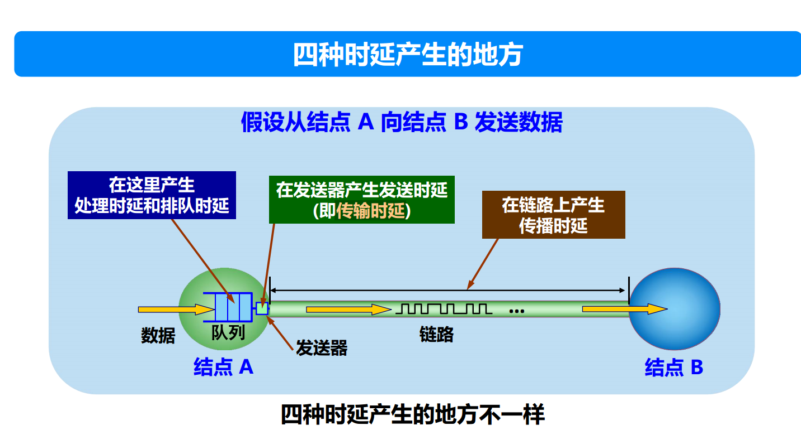

这张图片展示了网络通信中数据从节点 A 发送到节点 B 时产生的**四种时延**，分别是处理时延、排队时延、传输时延和传播时延。下面对这些时延的概念和其产生的地点进行详细解释。

---

### 1. **处理时延（Processing Delay）**
- **位置**：在节点 A 处理数据时产生（图片中标注为“处理时延”）。
- **定义**：处理时延是指网络设备（如路由器或主机）接收到数据后，用于检查比特级的错误、提取目标地址、处理报文头信息等操作所花费的时间。
- **特点**：
  - 处理时延通常较小（例如微秒级）。
  - 受设备的计算能力、数据包大小和复杂性影响。
- **优化**：提升设备的处理能力（例如使用更快的处理器）可以减少处理时延。

---

### 2. **排队时延（Queuing Delay）**
- **位置**：在节点 A 的队列中产生（图片中标注为“排队时延”）。
- **定义**：排队时延是指数据包在节点的发送队列中等待发送的时间。这种时延主要取决于当前网络设备的负载情况。
- **特点**：
  - 如果网络流量较低，排队时延可能接近于零。
  - 当网络繁忙（流量拥塞）时，排队时延可能非常高。
  - 不确定性较大，因为它与其他设备的行为和网络的瞬时负载相关。
- **优化**：通过流量工程、流量整形或增大设备队列容量可以缓解排队时延问题。

---

### 3. **传输时延（Transmission Delay）**
- **位置**：在节点 A 的发送器处产生（图片中标注为“传输时延”）。
- **定义**：传输时延是指将数据包从设备的发送器传输到链路上所需的时间。
- **计算公式**：
  $$
  \text{传输时延} = \frac{\text{数据包大小（比特）}}{\text{链路带宽（比特/秒）}}
  $$
- **特点**：
  - 受数据包大小和链路带宽的影响。
  - 链路带宽越高，传输时延越小；数据包越大，传输时延越高。
  - 对于较大的数据包或低速链路，传输时延可能占主导地位。
- **优化**：提升链路带宽或减少数据包大小可以降低传输时延。

---

### 4. **传播时延（Propagation Delay）**
- **位置**：在链路上传输时产生（图片中标注为“传播时延”）。
- **定义**：传播时延是指数据从节点 A 传输到节点 B 的链路上传播所需的时间。
- **计算公式**：
  $$
  \text{传播时延} = \frac{\text{链路长度（米）}}{\text{信号传播速度（米/秒）}}
  $$
- **特点**：
  - 主要取决于链路的物理长度和信号在介质中的传播速度。
  - 信号在光纤中的速度接近光速，在铜线中的传播速度略低。
  - 传播时延与数据包大小无关，取决于链路距离。
- **优化**：缩短链路长度或改用传播速度更快的介质（如光纤）可以减少传播时延。

---

### 计算时延的总和
网络总时延是这四种时延的加总：
$$
\text{总时延} = \text{处理时延} + \text{排队时延} + \text{传输时延} + \text{传播时延}
$$

---

### 四种时延的总结对比

| 时延类型     | 定义                                       | 影响因素                                | 特点                                  | 优化方法                       |
|--------------|--------------------------------------------|-----------------------------------------|---------------------------------------|--------------------------------|
| **处理时延** | 数据包在节点的处理时间                     | 设备性能、报文复杂性                    | 时间较短，确定性高                    | 提升设备性能                   |
| **排队时延** | 数据包在队列中等待的时间                   | 网络负载、队列长度                      | 不确定性高，随流量负载变化            | 流量整形、拥塞控制             |
| **传输时延** | 数据包从发送器发送到链路的时间             | 数据包大小、链路带宽                    | 数据包越大时延越高                    | 提升带宽，减少数据包大小       |
| **传播时延** | 数据在链路中传播的时间                     | 链路距离、信号传播速度                  | 与数据包大小无关，与链路距离相关      | 缩短距离，使用高效传播介质     |

---

### 实际场景中的影响
- **短距离网络**：在局域网（LAN）中，处理时延和排队时延占主导地位，因为传播时延和传输时延较短。
- **长距离网络**：在广域网（WAN）中，传播时延可能成为主要瓶颈，例如跨洋光缆通信。
- **拥塞场景**：在高负载的网络中，排队时延显著增加，是影响性能的主要因素。

---

### 结论
这四种时延涵盖了从数据生成到接收整个过程中产生的延迟。理解它们的特性和影响因素有助于优化网络性能，提高数据传输的效率。

----
### **时延的种类及其原因**

在网络通信中，时延（Latency）是指数据从源设备传输到目标设备所需的时间。时延是衡量网络性能的重要指标之一。影响时延的因素很多，通常包括以下几种类型的时延：

#### 1. **传播时延（Propagation Delay）**
   - **定义**：传播时延是指数据从源设备传输到目标设备的物理介质中所需的时间。它与数据在传输介质中的传播速度和物理距离有关。
   - **公式**：  
     \[
     \text{Propagation Delay} = \frac{\text{Distance}}{\text{Propagation Speed}}
     \]
   - **原因**：传播时延主要受以下因素影响：
     - **传输介质的物理特性**：不同的介质（如光纤、电缆、无线信号等）有不同的传播速度，光纤比电缆传播速度更快。
     - **数据传输距离**：数据从源到目的地的物理距离越远，传播时延就越长。

#### 2. **传输时延（Transmission Delay）**
   - **定义**：传输时延是指将数据从源主机的传输接口（如网卡）传输到目标主机的传输接口所需的时间。它与数据包的大小和链路的带宽有关。
   - **公式**：
     \[
     \text{Transmission Delay} = \frac{\text{Packet Size}}{\text{Bandwidth}}
     \]
   - **原因**：传输时延的影响因素包括：
     - **数据包大小**：数据包越大，传输时延越长。
     - **链路带宽**：链路的带宽越大，传输时延越短。带宽大意味着每秒钟可以传输的数据量更多。

#### 3. **排队时延（Queuing Delay）**
   - **定义**：排队时延是指数据在路由器或交换机中等待处理的时间。数据包可能会在设备的队列中排队等待处理，尤其是在网络繁忙时。
   - **原因**：排队时延通常受以下因素影响：
     - **网络拥塞**：当网络流量过大，路由器和交换机的缓存队列可能满，导致数据包排队等待。
     - **路由器性能**：路由器的处理能力有限，设备性能差或路由决策复杂时，会导致排队时延增加。

#### 4. **处理时延（Processing Delay）**
   - **定义**：处理时延是指路由器或交换机处理数据包所需的时间，包括解析包头信息、路由查找、错误检查等。
   - **原因**：处理时延的大小与路由器或交换机的处理能力、数据包复杂性等有关：
     - **设备性能**：路由器或交换机的处理速度较慢时，处理时延会更长。
     - **包头检查和路由查找**：路由器需要对每个数据包的头部进行解析，进行路由查找等操作，这些都会增加处理时延。

#### 5. **应用时延（Application Delay）**
   - **定义**：应用时延是指数据从应用程序发送或接收到的时间延迟，通常与应用程序本身的处理过程相关。
   - **原因**：应用时延通常由应用程序的设计、协议的使用、数据的格式化等因素引起：
     - **应用层协议的开销**：如 HTTP、FTP 等协议的处理会产生额外的时延。
     - **数据压缩和加密**：为了提高安全性或减少数据量，应用程序可能会对数据进行压缩或加密，这会增加处理时间。

### **上网时快慢的原因**

上网时速度快慢通常是由多种因素共同作用的结果，主要原因可以归结为以下几点：

#### 1. **网络带宽（Bandwidth）**
   - **带宽是网络中每秒钟能够传输的数据量**，也就是网络的传输能力。带宽越大，单位时间内能够传输更多的数据，网络速度越快。如果网络带宽较低，传输速度就会变慢。
   - **原因**：网络带宽受限于物理媒介（如光纤、电缆、无线信号）的能力。例如，家庭宽带、5G 网络与光纤互联网相比，带宽较小，导致网络速度慢。

#### 2. **网络延迟（Latency）**
   - **时延越高，网络响应越慢**。如果网络中存在较大的传播时延、传输时延或排队时延，数据包在网络中传输的时间较长，导致网络体验较差。网络延迟大通常是由于物理距离远、网络拥堵、路由复杂等原因引起的。
   - **原因**：网络延迟与网络架构、路由器的性能、地理位置等密切相关。比如，跨大洲访问服务器时，时延较高；而本地访问时，时延较低。

#### 3. **网络拥塞**
   - 当多个用户或设备在同一网络中使用时，可能会出现网络拥塞的情况，导致**排队时延增加**，从而影响上网速度。网络拥塞发生在路由器或交换机的缓存区队列满时，数据包需要等待处理。
   - **原因**：高流量时，网络中的数据包会互相排队等待处理，尤其是在高峰时段。比如，多个用户同时观看高清视频或下载大文件时，会导致网络拥堵，影响速度。

#### 4. **服务器响应速度**
   - **服务器的性能和负载**会直接影响网页加载速度和下载速度。如果服务器繁忙或性能差，响应会变慢，导致上网速度较慢。
   - **原因**：当访问的服务器负载较高或处理能力不足时，响应延迟增加，导致请求和响应之间的时延增大，从而影响用户体验。

#### 5. **中间网络设备的质量（如路由器、交换机）**
   - 中间设备（如路由器、交换机）的**性能和配置**对上网速度有重要影响。如果这些设备处理能力差或配置不当，可能会导致较大的**处理时延**或**排队时延**。
   - **原因**：低质量或配置不当的路由器会增加数据包处理和转发的时间，影响网络的整体响应速度。

#### 6. **DNS 查询速度**
   - **DNS 查询延迟**也可能影响上网速度。当用户访问一个网站时，首先需要通过 DNS 解析域名，获得目标网站的 IP 地址。如果 DNS 解析服务器的响应较慢，就会导致访问网页的延迟。
   - **原因**：DNS 解析速度受 DNS 服务器的响应时间和缓存情况影响。如果使用的是远离用户的 DNS 服务器，或者 DNS 服务器负载过高，可能会导致延迟增加。

#### 7. **无线网络的干扰**
   - **无线网络的干扰**会导致信号传输不稳定，从而降低上网速度。无线信号可能受到物理障碍（如墙壁）和其他无线设备（如微波炉、蓝牙设备等）的干扰。
   - **原因**：无线网络通常比有线网络更容易受到干扰，尤其在拥挤的环境中，多个设备共享相同频段时，可能会造成信号干扰，影响上网速度。

#### 8. **光纤与铜线的差异**
   - **光纤**网络的传输速度比传统的 **ADSL** 或 **Cable** 网络快得多。光纤具有更高的带宽、更低的延迟和更好的抗干扰能力，适合高带宽、高速度的互联网服务。
   - **原因**：光纤是目前最先进的通信媒介，能够提供更快的互联网连接速度，而铜线（如传统的电话线）则限制了数据传输的速度。

### **总结**

网络时延主要分为传播时延、传输时延、排队时延、处理时延和应用时延等。时延产生的原因通常涉及物理距离、带宽、设备性能、网络拥堵等因素。

上网时速度快慢的原因则更为复杂，涉及带宽、延迟、网络拥塞、服务器性能、DNS 查询速度等多个因素。了解这些原因有助于诊断和优化网络性能，提高上网体验。