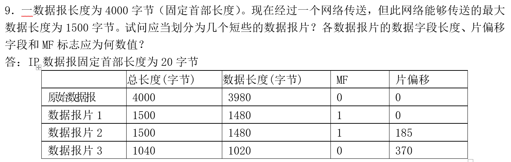

在计算机网络中，传输层和网络层是不同的协议层，每一层都负责不同的功能，处理不同类型的分组（或称为“包”）。虽然传输层已经对数据进行分组处理，但网络层仍然需要进一步对数据进行分组，主要是因为网络层处理的任务和传输层有所不同，涉及到的传输范围、地址解析以及路由选择等因素也不同。因此，网络层在传输层分组的基础上可能还需要进一步进行分组，具体原因如下：

### 1. **传输层的分组（传输层段）**
传输层（如 TCP 或 UDP）负责端到端的通信，它主要关注的是可靠的、面向连接的通信（例如 TCP）或者无连接的通信（例如 UDP）。传输层将应用层传输的数据分割成适合网络传输的小数据单元，每个单元称为“**传输层段**”或“**数据报文段**”。

- **TCP 和 UDP 的数据包**：在 TCP 协议中，每个数据包（段）通常包含应用数据以及控制信息（如端口号、序列号等），而在 UDP 协议中，它的包头较小，只有简单的源和目标端口信息，以及校验和等。
- **目的**：传输层主要是将大块的应用数据（如网页内容、文件等）分割成多个小数据段，以便适应下层网络的传输和保证端到端的可靠性（如TCP会进行重传、流量控制和顺序保证等）。

### 2. **网络层的分组（网络层包）**
网络层（如 IP）负责将数据从源设备传输到目标设备，通常需要跨越多个路由器或网络设备。网络层将接收到的传输层段（通常是 TCP 或 UDP 段）封装成 **IP 数据包**（或称为“分组”），并加上必要的网络层头部信息，如源和目的 IP 地址、路由信息等。

#### 为什么网络层需要重新分组？
传输层和网络层的分组（或包）结构不同，主要有以下几个原因：

### 2.1 **不同的封装与地址处理**
- **封装不同**：传输层将数据分割为传输层段，而网络层对这些传输层段进行封装，增加 IP 头部信息（例如源IP地址、目的IP地址、TTL等），以便在互联网上进行路由和传输。
- **地址空间不同**：传输层使用端口号来标识通信的应用程序（例如 TCP 端口或 UDP 端口），而网络层使用 IP 地址来标识主机或网络。因此，网络层需要对传输层段进行封装，加入源和目标 IP 地址，以便路由器能够正确地转发数据包。

### 2.2 **不同的分组大小**
- **传输层段的大小**：传输层段通常是为了确保数据可以在传输层之间顺利传输而划分的，它的大小可能并不适合网络层的传输。传输层段的大小受应用协议和网络连接的限制（如 TCP 最大段大小 MSS）等影响。
- **网络层的分组大小限制**：网络层的分组大小受物理层的传输媒介限制。例如，Ethernet 最大的帧大小是 1500 字节，如果传输层的段超过了该大小，网络层就需要进行 **分片**，即将过大的数据包拆分成多个较小的网络层分组，以便能够在物理网络中传输。

### 2.3 **数据包的路由与转发**
- **路由与转发**：网络层的一个重要功能是根据目标 IP 地址将数据包传送到目标设备。如果数据包太大，可能会由于不同网络设备或链路的 MTU（最大传输单元）限制而无法直接传输。为了应对这个问题，网络层会根据需要对数据包进行 **分片**，并通过不同的路由转发到目标主机。

### 3. **网络层的分片与重组**
网络层需要进行分组的一个关键原因是它需要考虑不同的物理媒介和链路的最大传输单元（MTU）限制。如果传输层的分段大小超过了某个链路的 MTU，网络层就会 **分片** 数据包，将一个大的数据包分割成多个小的片段进行传输。接收端在收到所有片段后会重新组合（**重组**）这些片段，恢复出原始的数据包。

#### 例子：
- **IP 分片**：假设网络链路的 MTU 为 1500 字节，而传输层的数据段为 2000 字节，网络层就会将其分成多个较小的 IP 包，每个包的大小为 1500 字节。每个分片会加上分片标识、偏移量等信息，以便接收端能够正确地将这些分片重组。
  
  - **IP 包头中的分片信息**：
    - **标识字段（Identification）**：所有分片使用相同的标识符。
    - **偏移量（Fragment Offset）**：指示每个分片在原始数据包中的位置。
    - **更多分片（More Fragments）标志**：标识是否还有更多分片。

### 4. **网络层的可靠性与不可靠性**
虽然传输层（特别是 TCP）提供了可靠的数据传输，但网络层（如 IP 协议）本身是 **不可靠** 的。它只负责尽可能将数据从源地址传输到目标地址，而不保证数据到达的可靠性或顺序。因此，网络层在分组过程中并不会进行错误恢复或重新排序，只是在需要时进行分片或传输。传输层在接收数据时需要负责对这些分片进行重组，并且在出现丢包时重新传输。

### 5. **总结：传输层和网络层的分组区别**
- **传输层**：负责对数据进行分段（segmenting），将应用数据切割成合适大小的段以便于传输。传输层的分段主要关注端到端通信（如端口号），并且会使用诸如 TCP、UDP 等协议进行控制和管理。
- **网络层**：在传输层分段的基础上进行封装，形成网络层的 **IP 数据包**。网络层的分组不仅要关注端到端的数据传输，还需要关注如何通过不同的路由器进行转发，并且考虑物理链路的传输限制（如 MTU）。如果传输层段过大，网络层需要进行 **分片** 来保证数据能够顺利传输。

网络层分组的关键功能包括：
- 处理网络地址（如 IP 地址）。
- 管理跨网络的数据传输。
- 根据需要对数据进行分片，确保适应不同网络的传输限制。
- 确保数据包在网络中的正确路由与转发。

因此，网络层仍然需要进行分组，以确保数据在不同的网络间高效、可靠地传输，并适应不同物理链路的限制。