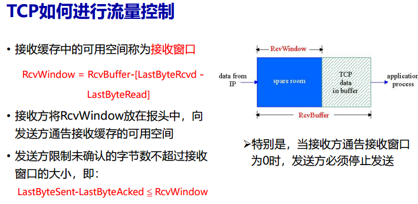

TCP流量控制是通过接收窗口（RcvWindow）来实现的。接收窗口表示接收缓冲区中可用的空间大小。具体计算公式为：
$$
RcvWindow = RcvBuffer - (LastByteRcvd - LastByteRead)
$$
其中：
- RcvBuffer 是接收缓冲区的总大小。
- LastByteRcvd 是最后一个接收到的字节。
- LastByteRead 是最后一个被应用程序读取的字节。

接收方会将 RcvWindow 的值放在报文中，通知发送方当前的可用空间。发送方根据接收方的 RcvWindow 来调整发送的数据量，确保不会超过接收方的缓冲区容量。

特别地，当接收方通知接收窗口为 0 时，发送方必须停止发送数据，直到接收到新的窗口大小信息。

发送方通过以下条件来确保发送的数据量不超过接收窗口的大小：
$$
LastByteSent - LastByteAcked ≤ RcvWindow
$$
这意味着发送方只能发送未被确认的字节数不超过接收窗口的大小。这样可以有效避免网络拥塞和数据丢失，提高传输效率。

----

### TCP流量控制详解

TCP流量控制的核心目标是确保发送方不会发送超过接收方缓冲区处理能力的数据，从而避免接收方因为无法及时处理过多数据而发生溢出。TCP使用接收窗口（**RcvWindow**）来实现这一点，接收窗口的大小告诉发送方接收方可以接收多少数据。

### 1. **接收窗口的定义**

接收方通过维护一个缓冲区来存储接收到的数据。接收窗口（**RcvWindow**）表示接收方缓冲区中可用的空间。接收方在TCP报文头中的**窗口大小**字段中通知发送方当前的接收窗口大小。该大小是接收方缓存中未被应用层消费的数据与缓冲区总大小之间的差值：

$$
\text{RcvWindow} = \text{RcvBuffer} - (\text{LastByteRcvd} - \text{LastByteRead})
$$

- **RcvBuffer**：接收缓冲区的总大小。
- **LastByteRcvd**：接收到的最后一个字节的序列号。
- **LastByteRead**：应用程序从接收缓冲区读取的最后一个字节的序列号。

接收方通过报文段的窗口大小字段向发送方通告接收窗口的当前大小，表示接收方能处理的剩余数据量。发送方基于这个信息来决定可发送的数据量。

### 2. **发送方的流量控制**

发送方必须确保其未确认的数据量（**LastByteSent - LastByteAcked**）不超过接收方通告的接收窗口大小（**RcvWindow**）。如果接收窗口很小，发送方会减少发送的数据量，甚至在接收窗口为零时暂停发送数据。

当接收窗口为零时，发送方必须停止发送数据。接收方通过将接收窗口大小设为零来告知发送方当前无法接收更多数据。

### 3. **接收方通告零窗口和非零窗口**

- **零窗口通告**：当接收方的接收缓冲区已满且无法接收更多数据时，接收方将接收窗口大小设为零，并通知发送方停止发送数据。
  
- **非零窗口通告**：当接收方的接收缓冲区释放了空间，可以接收更多数据时，接收方会更新接收窗口大小并通告给发送方。

### 4. **零窗口探测（Zero Window Probe）**

当接收窗口被设为零时，发送方会停止发送数据。接收方在某个时刻可能消费了一些数据，释放了接收缓冲区的空间。为了触发接收方更新接收窗口，发送方会在接收到零窗口通告后，发送一个零窗口探测报文段。

- **零窗口探测**：当发送方接收到接收窗口为零的通告后，会启动一个定时器（坚持定时器）。定时器超时后，发送方会发送一个零窗口探测报文段，该报文段的序列号是上一个报文段最后一个字节的序列号。接收方收到该探测报文段后，会返回一个包含当前接收窗口大小的响应报文段。如果接收窗口仍为零，发送方会再次发送零窗口探测报文段，直到接收到一个非零的窗口通告。

### 5. **糊涂窗口综合症（Silly Window Syndrome）**

当接收方的消费速度很慢，而发送方的数据发送速度很快时，接收方可能频繁地发出非常小的接收窗口通告，这导致发送方发送许多小的数据包（即使接收方还没完全消费前面的数据）。这会导致带宽的浪费，并且使得传输效率低下。

#### **接收方的启发式策略**

为了解决糊涂窗口综合症，接收方使用启发式策略来减少零窗口通告的频率。具体策略如下：

- **窗口显著增加**：接收方只在接收窗口大小显著增加时才会通告新的窗口大小。具体地，窗口大小的增加需要达到缓存空间的一半，或者一个最大报文段大小（MSS），以较小者为准。
  
- **延迟确认**：当接收窗口很小，但还未达到上述的显著增加标准时，接收方会推迟发送窗口更新。接收方不会频繁更新窗口，避免发送过多的小窗口通告。最多延迟500ms，且每次在延迟的最大时间内，至少会确认一次数据。

#### **发送方的启发式策略（Nagle算法）**

Nagle算法的主要目标是减少网络中小包的数量，从而提高TCP的传输效率。发送方的启发式策略如下：

- **积累数据**：发送方尽量等待一段时间，直到积累足够的数据再发送一个完整的TCP报文段，而不是每收到一个字节就发送一个小的报文段。
  
- **MSS和确认**：如果等待一段时间后，发送缓存中有足够的数据（达到一个MSS），或者上一次发送的数据已经得到了确认（即确认已经到达），发送方就会发送一个新的TCP报文段。

- **Nagle算法的优点**：通过避免频繁发送小数据包，Nagle算法减少了网络中的拥塞，降低了协议的开销。它适应了不同的网络延时、MSS长度以及应用程序的数据生成速度。

### 6. **TCP流量控制小结**

- **接收端（RcvWindow）**：
  - 使用显式窗口通告，告知发送方接收缓冲区的可用空间。
  - 在接收窗口较小时，接收方可以延迟确认数据，以期缓冲区有更多空间释放。
  - 仅当接收窗口显著增加时，才会更新并通告新的窗口大小。

- **发送端**：
  - 根据接收方的窗口大小限制发送的数据量，确保未确认的字节数不超过接收窗口。
  - 使用Nagle算法来积累足够的数据后再发送，避免发送过多小的数据包，提升吞吐量。
  
通过流量控制，TCP能够有效地管理数据流，确保传输效率和接收端不会因缓存溢出而丢失数据。