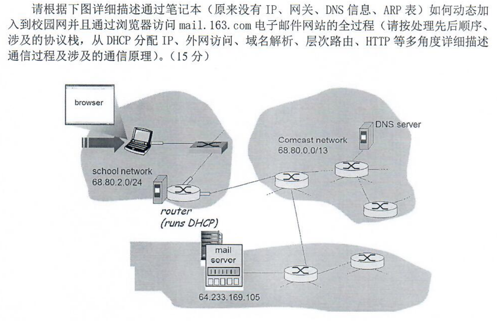

根据图中所示，访问mail1.163.com的详细过程如下，包含相关的计算机网络技术解释：

1. **初始状态**：
   - 用户在浏览器中输入mail1.163.com
   - 用户所在的学校网络IP地址段为68.80.2.0/24
   - 学校网络中有路由器(含DHCP服务)

2. **DHCP配置**：
   - 客户端通过DHCP（动态主机配置协议）获取网络配置
   - DHCP过程：
     a. DHCP Discover: 客户端广播寻找DHCP服务器
     b. DHCP Offer: DHCP服务器响应，提供可用IP地址
     c. DHCP Request: 客户端请求使用提供的IP地址
     d. DHCP Ack: DHCP服务器确认，分配IP地址(68.80.2.x)
   - 客户端获得IP地址、子网掩码、默认网关和DNS服务器地址

3. **DNS解析**：
   - 客户端向DNS服务器(68.80.0.13)发送UDP查询请求（端口53）
   - DNS解析过程：
     a. 客户端查询本地DNS缓存
     b. 若未命中，向DNS服务器发送递归查询
     c. DNS服务器可能需要迭代查询顶级域名服务器
   - DNS服务器解析mail1.163.com的IP地址(64.233.160.105)
   - 使用资源记录（RR）返回A记录给客户端

4. **路由转发**：
   - 数据包从客户端经过学校网络的路由器
     - 使用ARP协议解析下一跳IP地址的MAC地址
     - 路由器检查路由表，决定下一跳
   - 通过运营商网络(Comcast network)中的多个路由器
     - 使用BGP（边界网关协议）在AS之间进行路由选择
     - 内部可能使用OSPF或IS-IS等IGP协议
   - 最终到达目标服务器(64.233.160.105)
     - 使用NAT（网络地址转换）穿越不同网络

5. **HTTP通信**：
   - 客户端与邮件服务器建立TCP三次握手
     a. SYN: 客户端发送同步序列号
     b. SYN-ACK: 服务器确认并发送自己的同步序列号
     c. ACK: 客户端确认
   - 建立TLS/SSL加密通道（HTTPS）
     - 进行证书验证和密钥交换
   - 客户端发送HTTP GET/POST请求
   - 服务器响应，返回邮件系统登录页面
   - 后续的邮件收发使用IMAP或POP3协议

整个过程涉及:
- 数据链路层：ARP协议
- 网络层：IP协议、ICMP协议
- 传输层：TCP协议（用于HTTP）、UDP协议（用于DNS）
- 应用层：DHCP、DNS、HTTP/HTTPS、IMAP/POP3

